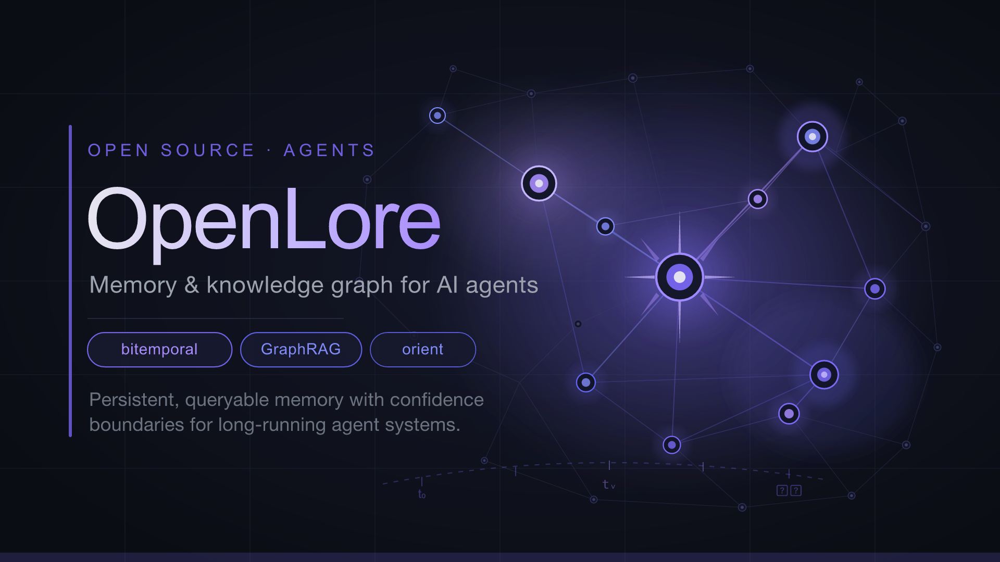
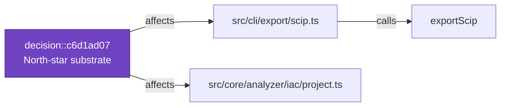

<h1 align="center">OpenLore</h1>

<p align="center">
  <strong>A local-first, deterministic intelligence graph that eliminates repetitive file reads for AI coding agents</strong><br>
  tracks context freshness, and unifies code, infrastructure, and architectural decisions<br>
  into a single, safety-gated governance runtime.
</p>

<p align="center">
  <a href="https://www.npmjs.com/package/openlore"></a>
  <a href="https://github.com/clay-good/OpenLore/actions/workflows/ci.yml"></a>
  <a href="LICENSE"></a>
  =22.5">
  <br>
  
  
  
  
  <a href="https://github.com/clay-good/OpenLore/stargazers"></a>
</p>

<p align="center">
  
</p>

<p align="center">
  
</p>

<p align="center"><em>Onboard a 7,066-file repo once, then replace "grep 75 files and hope" with one deterministic call that returns the exact blast radius.</em></p>

---

AI coding agents are powerful but amnesiac: every task starts by re-reading the same files to rediscover structure, and every long session quietly drifts toward confident-but-stale assumptions. OpenLore runs a **one-time static analysis** of your codebase and keeps a navigable knowledge graph — call structure, types, tests, decisions, and spec drift — incrementally fresh as you edit. Agents query it through **MCP tools** (or the CLI) to start every task already oriented. It is **deterministic and local-first** — no LLM in the hot path — so the same question returns the same grounded answer, and an agent is *told when a fact has gone stale* rather than served a confident guess.

### What you get

- 🧠 **Persistent architectural memory** — `orient()` once; agents stop re-deriving the system from dozens of file reads, across sessions.
- ⚡ **Deterministic & local-first** — pure static analysis, no API key, no network, same answer every time. `orient()` runs in **~430µs p50** on a 15k-node graph.
- 🔭 **One-call orientation** — `orient(task)` returns the relevant functions, their callers, matching spec sections, and insertion-point candidates in a single call.
- 🕸️ **One unified graph** — application code, **Infrastructure-as-Code**, and **architectural decisions** all project onto the same node/edge primitives, so a single traversal answers questions that span all three.
- 🧪 **Test-impact selection** — "I changed `parseConfig()` — which tests should I run?" answered by backward call-graph reachability.
- ☠️ **Dead-code & reachability** — cross-language mark-and-sweep over **18 languages**, confidence-tagged, never deletion authority.
- 🧭 **Context-freshness tracking (Epistemic Lease)** — every response carries a factual freshness note when your cached context ages or the repo moves.
- 🛡️ **Safety-gated governance** — architectural decisions recorded, gated at commit, and synced into living specs; spec/code **drift detected in milliseconds**, no API key.
- 📊 **Benchmarked & honest** — **−26% agent round-trips** on deep traces in large repos; we publish the losses next to the wins and every claim traces to a command you can run.

<p align="center">
  <strong><a href="#5-minute-quickstart">Quickstart</a> · <a href="#value-scorecard--does-it-pay-for-itself">Benchmarks</a> · <a href="#how-it-works">How it works</a> · <a href="#core-features">Features</a> · <a href="#openlore-vs-alternatives">vs. Alternatives</a> · <a href="#documentation">Docs</a></strong>
</p>

> **New here?** `npm install -g openlore && openlore install` — one command detects your agent, wires it up, and builds the index. No API key. Jump to the [5-Minute Quickstart](#5-minute-quickstart).

> Migrating from `spec-gen`? The package is now [`openlore`](https://www.npmjs.com/package/openlore) and the command is `openlore` — see [docs/RENAME-TO-OPENLORE.md](docs/RENAME-TO-OPENLORE.md) for the short checklist (rename `.spec-gen/` → `.openlore/`, reinstall).

---

## Value Scorecard — does it pay for itself?

OpenLore only earns its place if an agent **with** it reaches a correct answer for less total cost than the same agent **without** it. We measure that inequality and publish it — wins **and** losses. Numbers are from the Spec 14 agent benchmark (`claude -p`, sonnet, N=4 medians, pinned SHAs, `--strict-mcp-config` isolating each arm), measured **2026-06-01**.

| Scenario (task × repo) | Cost Δ | Round-trips Δ | Correctness | Verdict |
|---|---|---|---|---|
| **Large/unfamiliar repo · deep "how does X flow through Y"** *(its target)* | **−7% to −21%** | **−26%** | 100% = 100% | ✅ helps — and the win grows with repo size |
| Small/familiar repo · shallow "who calls X" | **task-dependent** *(Round 1: +43%)* | **+38%** | 100% = 100% | ❌ often adds overhead — measure with `openlore prove` |

> **Re-confirmed live 2026-06-03 (N=2):** the deep-task win **reproduces** — okhttp **−13%, identical to the table below**. The small/familiar case is **task-dependent, not a flat loss**: same repo class, opposite outcomes (chalk **−32%** win vs express **+59%** loss) — the cost there is a sometimes-redundant `orient` round-trip, not tool-schema bytes, so a leaner surface doesn't close it. Don't guess from our repos — run **`openlore prove`** on yours.

Deep-trace detail — the win scales with codebase size (cost Δ; round-trips WITHOUT → WITH):

| Repo (size) | Cost Δ | Round-trips |
|---|---|---|
| excalidraw (~640 files) | **−21%** | 25 → 16 |
| tokio (~790 files) | **−21%** | 17 → 13 |
| okhttp | **−13%** | 13 → 11 |
| django (~3k files) | **−7%** | 21 → 15 |
| gin (110 files, smallest) | +4% *(≈even)* | 10 → 9 |

**When OpenLore helps — and when it doesn't:**
- **Helps:** large, unfamiliar, or private codebases the model hasn't memorized; deep multi-hop questions; long sessions where re-reading an ever-growing context compounds. The most consistent, hardest-to-game signal is **round-trips: −26%, fewer on every deep task.**
- **Doesn't (yet):** small, famous repos already in the model's weights answered by a shallow query — there's no orientation tax to remove, so the MCP tool surface is pure overhead.

**Reproduce it:** `npm run bench:agent` (needs an API key for the agent arm). Full methodology, per-task numbers, and caveats: [docs/AGENT-BENCHMARKS.md](docs/AGENT-BENCHMARKS.md). Plumbing latency (orient ~430µs p50) is separate and real: [scripts/BENCHMARKS.md](scripts/BENCHMARKS.md).

> **Honesty contract.** We never publish a savings number the benchmark didn't produce; we always show the loss cases next to the wins; the scorecard is date-stamped and re-measured after each optimization phase. Every public token claim traces to a command you can run in this repo — if it doesn't reproduce, treat it as marketing and call it out.

---

## Why It Exists

The amnesia is structural, not incidental. On every new task:

- They re-read the same source files to understand structure
- They forget architectural decisions made two sessions ago
- They have no link between specs and code — drift is invisible
- File-by-file navigation costs round-trips and fresh tokens that grow with repo size — on deep traces in large repos the WITHOUT baseline runs **17–25 tool-calls** to reach an answer; openlore cuts that **−26%** (see the [Value Scorecard](#value-scorecard--does-it-pay-for-itself) for the measured numbers, and where it does *not* help)
- In long sessions, they drift from authoritative retrieval toward internally cached reasoning — producing subtly wrong architectural assumptions that compound silently until a refactor breaks

openlore closes this loop. Run a full analysis once, then keep the graph incrementally updated as the codebase evolves. Even greenfield projects become cognitively "brownfield" after only a few agent sessions — architectural context fragments, decisions disappear, and agents repeatedly reconstruct the same understanding from scratch.

openlore persists that context continuously: structure, specs, decisions, drift state, and graph relationships remain queryable across sessions.

---

## How It Works

Three layers, each usable independently:

| Layer | What it does | API key? |
|-------|-------------|----------|
| **1. Static Analysis** | Call graph, clusters, McCabe CC, external deps → `CODEBASE.md` digest | No |
| **2. Spec Layer** | LLM-generated living specs, ADRs, drift detection, decision gates | For generation |
| **3. Agent Runtime** | 60 MCP tools — `orient()`, semantic search, graph expansion | No |

You can use layer 1 alone to give agents structural context. Add layer 2 for semantic intent and architectural governance through OpenSpec-compatible living specifications. Layer 3 keeps that context continuously accessible through graph-native MCP tools once `openlore mcp` is running.

---

## openlore vs. Alternatives

| | Cursor / Claude Code | Sourcegraph | openlore |
|---|---|---|---|
| Graph-aware MCP context | ❌ file-based reads | Partial | ✓ call graph + clusters |
| Spec drift detection | ❌ | ❌ | ✓ milliseconds, no API |
| Architectural decision gates | ❌ | ❌ | ✓ pre-commit hook |
| Offline structural analysis | ❌ | ❌ | ✓ |
| Token-efficient orient() | ❌ | ❌ | ✓ −7%→−21% cost, −26% round-trips on deep tasks † |
| Living spec generation | ❌ | ❌ | ✓ |
| Persistent cross-session architectural memory | ❌ | Partial | ✓ |

† **Measured, and it depends on the task** (full numbers in the [Value Scorecard](#value-scorecard--does-it-pay-for-itself) above). The Spec 14 agent benchmark (`npm run bench:agent`, WITH vs
WITHOUT openlore, `claude -p`, N=4 medians) gives a two-tier result:
- **Small, familiar repos + shallow "who-calls-X" queries:** openlore *adds*
  ~43% cost — the model already knows the code, so there's no orientation to save.
- **Larger codebases + deep "how does X flow through Y" questions (its target):**
  with the lean `--preset navigation` tool surface, openlore is a **net win —
  −7% cost and −26% tool-calls at N=4, scaling with repo size (up to −21% on
  ~640–790-file repos)**, at 100% answer correctness in both arms.

So the headline savings hold where openlore is designed to help, not on toy
queries. Full results, methodology, and honest caveats:
[docs/AGENT-BENCHMARKS.md](docs/AGENT-BENCHMARKS.md). The plumbing latency (orient
~430µs p50) is separate and real — see [scripts/BENCHMARKS.md](scripts/BENCHMARKS.md).
| Long-session confidence decay (Epistemic Lease) | ❌ | ❌ | ✓ |

Traditional coding agents reconstruct architecture from repeated file reads every session. openlore persists it as a queryable graph.

---

## 5-Minute Quickstart

> **One command, no API key needed:**

```bash
npm install -g openlore
cd /path/to/your-project

openlore install          # detect your agent, wire it up, AND build the index
```

That single command:

1. **Auto-detects** which agent surfaces are present (Claude Code, Cursor, Cline, Continue, AGENTS.md) and wires each one to call `orient()` — no manual `CLAUDE.md` editing.
2. **Registers the MCP server** so it starts automatically when your agent launches (you don't run `openlore mcp` yourself).
3. **Builds the index** (`init` + `analyze` → a keyword/BM25 graph, no network needed) so `orient()` returns real results in your very first session — no separate `analyze` step.

```bash
openlore install --no-analyze   # wire surfaces only; build the index later
openlore install --dry-run      # preview every change without writing
```

See [docs/install.md](docs/install.md). The MCP server keeps the index fresh as you edit (file watcher on by default — large build dirs like `target/`, `node_modules/`, `dist/` are pruned automatically; disable entirely with `openlore mcp --no-watch-auto`).

Then ask your agent: **`orient("add a new payment method")`**

That single call returns the relevant functions, their call neighbours, matching spec sections, and insertion-point candidates — preserving architectural continuity across sessions instead of forcing the agent to repeatedly reconstruct context from raw file reads. The Spec 14 benchmark ([docs/AGENT-BENCHMARKS.md](docs/AGENT-BENCHMARKS.md)) measures this directly: on deep "how does X flow through Y" questions in larger codebases, openlore (with `--preset navigation`) cuts cost ~7% and tool-calls ~26% at N=4 (more on bigger repos); on small/familiar repos with shallow queries it adds overhead instead. Net: it pays off in its target arena, not on toy queries.

**Full pipeline** (specs + decisions — optional and additive):

```bash
openlore generate         # generate living specs (requires API key)
openlore drift            # detect spec/code drift
openlore decisions        # manage architectural decisions
```

<details>
<summary>Install from source</summary>

```bash
git clone https://github.com/clay-good/openlore
cd openlore
npm install && npm run build && npm link
```

</details>

<details>
<summary>Nix / NixOS</summary>

```bash
nix run github:clay-good/openlore -- analyze
nix shell github:clay-good/openlore
```

System flake:
```nix
environment.systemPackages = [ openlore.packages.x86_64-linux.default ];
```

</details>

---

## See It In Action

<details>
<summary>Example: orient("add a payment method")</summary>

```json
{
  "functions": [
    {
      "name": "processPayment",
      "file": "src/payments/processor.ts",
      "risk": "medium",
      "fanIn": 4,
      "callers": ["handleCheckout", "retryFailedCharge"],
      "callType": "direct"
    },
    {
      "name": "validateCard",
      "file": "src/payments/validator.ts",
      "risk": "low",
      "fanIn": 1,
      "testedBy": [{ "name": "validateCard.test.ts", "confidence": "called" }]
    }
  ],
  "specDomains": ["payments — §CardValidation, §PaymentFlow"],
  "insertionPoints": [
    "src/payments/processor.ts:87 — after existing charge logic"
  ],
  "callPath": "POST /charge → handleCheckout → processPayment → validateCard → stripeClient.charge"
}
```

One graph query replaces most exploratory file reads. The agent knows exactly where to look and what risks to consider.

</details>

---

## Agent Cheat Sheet

The full surface is 60 tools, but day-to-day work needs a handful. Reach for the right one by situation:

| Situation | Tool |
|-----------|------|
| Starting any task | `orient(task)` — functions, callers, specs, insertion points in one call |
| Shallow "who calls X / where is Y?" | `orient(task, lean:true)` (CLI `orient --lean`) — navigation core only, ~40% smaller and skips the enrichment compute (Spec 27) |
| "Which file/function handles X?" | `search_code` |
| Call topology across many files | `get_subgraph` / `analyze_impact` |
| "What's the blast radius if I change this?" | `analyze_impact` — risk score + up/downstream chain + **governing decisions** |
| "What decisions constrain this code?" | `analyze_impact` / `get_subgraph` → `governingDecisions` (Spec 16) |
| Planning where to add a feature | `suggest_insertion_points` |
| "How does request X reach function Y?" | `trace_execution_path` |
| "I changed X — which tests should I run?" | `select_tests` — backward reachability to the reaching tests + paths (Spec 19) |
| "What's dead / what dies if I delete X?" | `find_dead_code` — cross-language reachability, confidence-tagged candidates (Spec 20) |
| "What's the blast radius of my whole diff before I commit?" | `blast_radius` — one advisory briefing: callers/layers, tests to run, anchored memories/decisions that will drift, stale specs (CLI `openlore blast-radius`) |
| "What changed structurally / whose callers are now stale?" | `structural_diff` — graph diff, stale callers, rename flags (Spec 21) |
| "What changes together with this / what's volatile?" | `get_change_coupling` — co-change + churn from git history (Spec 22) |
| "May I add this import here / what breaks the architecture?" | `check_architecture` — pre-edit verdict against declared rules (Spec 23) |
| Recording an architectural choice | `record_decision` **before** writing the code |
| Reading / checking a spec | `get_spec` · `search_specs` · `check_spec_drift` |
| Ranking what changed by risk | `detect_changes` |

Everything else (read a file, grep, list files) uses your native tools. Full reference: [docs/mcp-tools.md](docs/mcp-tools.md).

---

## Use OpenLore as a Claude Code Skill

OpenLore ships a canonical [Claude Code Skill](https://docs.claude.com/en/docs/claude-code/skills) at [`skills/openlore-orient/`](skills/openlore-orient/). Install it once and Claude Code will automatically call `orient()` at the start of every task — no `CLAUDE.md` editing required.

```sh
# From the OpenLore repo root:
npm run skill:install-local           # → ~/.claude/skills/openlore-orient/

# Or copy into a single project's .claude/skills/:
cp -R skills/openlore-orient /path/to/your-project/.claude/skills/
```

The skill bundle ships a `SKILL.md` manifest, POSIX + PowerShell wrappers, a worked example, and a redacted real `orient()` JSON output so the model knows the response shape. See [`skills/openlore-orient/README.md`](skills/openlore-orient/README.md) for details.

### What's in `skills/` — and what actually installs

The `skills/` directory holds more than just `openlore-orient/`. Here's the map so nothing looks like a missing install step:

| Path | What it is | How it installs |
|---|---|---|
| [`skills/openlore-orient/`](skills/openlore-orient/) | The **canonical** Claude Code skill — the one we recommend everyone install. | `npm run skill:install-local`, or `cp -R` into a project's `.claude/skills/` |
| The 8 workflow skills (brainstorm, plan-refactor, execute-refactor, write-tests, review-changes, debug, implement-story, analyze-codebase) | Multi-agent **workflow** skills for Claude Code / OpenCode / Mistral Vibe. | `openlore setup` (sources them from [`examples/`](examples/) into `.claude/`, `.opencode/`, or `.vibe/`) |
| Loose top-level `skills/*.md` (e.g. `claude-openlore.md`, `openlore-plan-refactor.md`) | **Reference prompt templates** — copy-paste starting points, not auto-installed by any command. | Manual copy if you want them |

If you only install one thing, install `openlore-orient`. The workflow skills are opt-in via `openlore setup`; the loose `.md` files are just reference material.

---

## Core Features

**Analyze** (no API key)

Continuously maintains a structural representation of your codebase using pure static analysis. Builds a full call graph persisted to SQLite, runs label-propagation community detection to cluster tightly coupled functions, computes McCabe cyclomatic complexity for every function, and extracts DB schemas, HTTP routes, UI components, middleware chains, and environment variables. Outputs `.openlore/analysis/CODEBASE.md` — a ~600-token structural digest that compresses the equivalent of tens of thousands of exploratory tokens into a small, queryable summary.

With `--watch-auto`, the call graph updates incrementally on every file save: changed file and its direct callers are re-parsed and the graph is atomically swapped. Orient and BFS queries remain live between full analyze runs.

**Generate** (API key required)

Sends the analysis to an LLM in 6 structured stages: project survey → entity extraction → service analysis → API extraction → architecture synthesis → ADR enrichment. Produces `openspec/specs/` living specifications in RFC 2119 format with Given/When/Then scenarios.

**Drift** (no API key)

Compares git changes against spec mappings in milliseconds. Detects: Gap (code changed, spec not updated), Uncovered (new file, no spec), Stale (spec references deleted files), ADR gap (code changed in an ADR-referenced domain). Installs as a pre-commit hook.

**Install** (no API key)

`openlore install` auto-wires the popular agent surfaces (Claude Code, Cursor, Cline, Continue, AGENTS.md) so they call `orient()` automatically — no `CLAUDE.md` editing required. Each integration uses a fingerprinted managed block so re-runs are idempotent and hand-edits are detected. `--dry-run` previews diffs; `--uninstall` cleanly removes everything. See [docs/install.md](docs/install.md).

**Preflight** (no API key)

`openlore preflight` is a CI staleness gate: any pull request that edits files in the graph fails the check until the graph is refreshed. Drop-in templates for GitHub Actions, GitLab CI, and generic shell live in [`examples/ci/`](examples/ci/). Weighted scoring surfaces hubs first so a one-line leaf edit doesn't fail the same way a refactor of a top-of-stack module does. See [docs/preflight.md](docs/preflight.md).

**MCP** (no API key)

60 graph-native tools exposed over stdio. Together they act as a persistent architectural runtime for coding agents: orientation, graph traversal, semantic retrieval, drift awareness, decision context, and structural risk analysis.
`orient()` is the main entry point — it collapses the discovery loop into one call (measured: **−26% round-trips** on deep traces; see the [Value Scorecard](#value-scorecard--does-it-pay-for-itself)). `detect_changes` risk-scores changed functions using call graph centrality × change type multiplier. Every tool call runs the same guards — input validation against its schema (bad args → JSON-RPC `-32602`), a per-tool timeout, a deterministic output-size cap, and normalized error codes — and the surface carries complete MCP `annotations`. See [docs/mcp-tools.md](docs/mcp-tools.md).

`orient()` runs in **~430µs p50** against a 15k-node codebase (TypeScript compiler, ~79k edges). Full benchmark results: [scripts/BENCHMARKS.md](scripts/BENCHMARKS.md).

**Test impact selection** (no API key, Spec 19)

`select_tests` answers "I changed `parseConfig()` — which tests should I run?" by walking the call graph **backward** from the change to every test that transitively reaches it (via `calls` + `tested_by` + inheritance edges), returning each test with its reaching path. This is static, call-graph-based regression test selection (RTS) — established CS — served to the agent at edit time instead of to CI after the fact. grep can't do it (the reach is through indirect calls); the model is slow and guesses; a deterministic graph does it instantly. It is an honest **over-approximate prioritizer** ("run these first"), not a sound replacement for the full suite — the response states its posture, coverage, and caveats (dynamic dispatch / DI can under-select). Inputs: a symbol set or a git diff. Deterministic and offline. See [docs/test-impact-selection.md](docs/test-impact-selection.md).

**Reachability & dead-code** (no API key, Spec 20)

`find_dead_code` runs cross-language mark-and-sweep over the call graph: reachability from roots (tests, imported symbols, route handlers, `main`), candidate-dead = the unreached remainder, and "what becomes dead if I delete X?" = the set reachable only through X. Prior art (knip, ts-prune) is TS/JS-only; this rides the unified tree-sitter graph across 15+ languages. Results are **confidence-tagged candidates, never deletion authority** — dynamic dispatch, DI, framework routing, and externally-consumed exports cause false positives, stated in the response. A conservative module-level liveness signal keeps high-confidence candidates trustworthy (it cut them from ~470 to ~35 on a real repo). See [docs/reachability-dead-code.md](docs/reachability-dead-code.md).

**Structural change analysis** (no API key, Spec 21)

`structural_diff` is a graph diff — the structural complement to `git diff`. Between two states (working tree vs a ref, or two refs) it reports functions and edges added/removed, signature changes, and the existing callers in *other* files now **stale** because a callee's signature moved under them. A review/refactor agent gets "this removed `gamma`, changed `alpha`'s signature, and 5 of its callers are now stale" instead of "these 40 lines changed". Only the changed files are re-parsed (old via `git show`, new via the working tree), so it is cheap and never mutates the canonical graph; rename/move ambiguity is flagged, not guessed. See [docs/structural-diff.md](docs/structural-diff.md).

**Change-coupling & volatility** (no API key, Spec 22)

`get_change_coupling` mines two facts from local git history that the call graph structurally cannot see: **co-change coupling** ("these files almost always change together" — the *invisible* coupling with no import or call edge) and **volatility/churn** ("this file changed 23 times" — a risk flag). Prior art (CodeScene) puts it well: change coupling "isn’t possible to calculate from code alone — it is mined from git." Surfaced additively in `orient` as caution signals. Support/confidence thresholds and a bulk-commit filter keep it honest; it is an **advisory signal, correlation not causation**. Local, deterministic, no network (reuses the Spec 18 git ingestion). See [docs/change-coupling.md](docs/change-coupling.md).

**Architecture invariant guardrails** (no API key, Spec 23)

`check_architecture` turns an architectural rule from a post-hoc CI failure into a **pre-write** guardrail. A repo declares constraints — `layers`, `forbidden`, `allowedOnly` — in `.openlore/architecture.json` (or via an `Invariant:` marker on a synced ADR, so a recorded decision *carries* its invariant), and the tool answers, before the agent writes the import, *"may a file under A import B?"* with a deterministic verdict + the governing rule + why, plus a full violation scan. Prior art (ArchUnit, dependency-cruiser, import-linter) enforces architecture in CI *after* the code is written and per-language; OpenLore's contributions are **cross-language** rules over the unified dependency graph and **agent-facing, pre-edit** evaluation (reusing the same `classifyLayerEdge` primitive that powers `CODEBASE.md`'s layer report). Opt-in and fully inert until rules are declared; never LLM-inferred; complements, not replaces, CI linters. See [docs/architecture-invariants.md](docs/architecture-invariants.md).

**Epistemic Lease** (no API key)

> **Core principle**: EpistemicLease models architectural drift as a behavioral navigation phenomenon rather than a semantic understanding problem. Context decay is driven by where the agent goes (cross-module trajectory), not what it knows.

As a session grows longer, agents naturally shift from authoritative graph retrieval toward internally cached reasoning. This is useful for fluency but dangerous for architectural correctness — cross-module assumptions go stale, dependency hallucinations accumulate, and delegation prompts embed incorrect repository understanding that cannot easily be corrected downstream.

The Epistemic Lease models this decay explicitly. Once your cached context ages or the repository moves since your last `orient()`, every MCP tool response carries a brief, **factual freshness note** — minutes since `orient()`, the cognitive-load score, modules touched, and whether the repo has new commits — phrased as information you can act on, *not* a command (it closes with "Informational signal; you decide whether to act on it"). Decay is driven by time elapsed since `orient()`, weighted cognitive load (heavier tools count more), and cross-module access breadth. A repo that has moved since `orient()` — very often your own commits — is surfaced as a fact and nudges the note to *degraded*; it never expires your model, because committing well-understood work is the most-informed action in a session.

The note has two states, with a load-driven detail line so it stays skimmable without resorting to coercion:

| Level | Trigger | Note |
|---|---|---|
| Degraded | load ≥ 30, age ≥ 15min, density ≥ 0.15, or repo moved since `orient()` | One-line factual note appended |
| Stale | load ≥ 60, age ≥ 30min, or density ≥ 0.30 | One-line factual note prepended; severity (a short "a fair amount / a lot of analysis has accumulated" detail) is driven by accumulated cognitive load (≥ 85 / ≥ 110), **not** the wall clock |

Cross-module density is computed as a sliding-window trajectory model: `switches_in_last_15_calls / 15`. The fixed denominator prevents false positives during session warmup. Each module switch adds +5 cognitive debt; a high-density window adds +15; a burst (density ≥ 0.60) adds +20. A 5s dampening window prevents back-and-forth from double-counting.

An oscillation coefficient (`repeated_bigram_transitions / total_transitions`) separately distinguishes confusion loops (A→B→A→B scores 1.0) from genuine exploration (A→B→C→D scores 0.0). Severity within *stale* is driven by accumulated cognitive load, not the wall clock — so an idle-but-oriented session never escalates on time alone; once stale, a heavy architectural tool (weight ≥ 8) or density burst (≥ 0.60) is a genuine activity burst that raises the note to its highest detail.

When fresh, injection is zero-overhead. Calling `orient()` resets the tracker. The lease never blocks and never commands — it surfaces neutral facts and leaves the decision to the agent, the same facts-not-coercion principle as the rest of OpenLore (decision `8e95746d`).

**Decisions** (API key for consolidation)

Agents call `record_decision` before writing code. Consolidation runs immediately in the background. At commit time, a pre-commit hook gates the commit until all verified decisions are reviewed and written back as requirements in `spec.md` files. Decisions are classified by scope (`local / component / cross-domain / system`); only `cross-domain` and `system` decisions produce ADR files, keeping the decision log signal-dense.

Decisions are also **first-class graph nodes**. At analyze time the active decision store is projected — the same parser→projector split that puts Infrastructure-as-Code on the graph — into `decision::<id>` nodes joined to the files they govern by `affects` edges. The relationship is stored, not recomputed: `analyze_impact` and `get_subgraph` return the governing decisions of a symbol and its blast radius as typed neighbors (`nodeType: "decision"`), and `orient` reports which relevant files each decision governs. This turns "what architectural decisions constrain this code, and what does changing it implicate?" into a deterministic graph query — the join no code-navigation competitor offers. The JSON store stays authoritative; the projection is derived and rebuilt on every analyze. See [docs/specs/openlore-spec-16-decisions-as-graph-nodes.md](docs/specs/openlore-spec-16-decisions-as-graph-nodes.md).

**Provenance** (no API key, local-only)

Reads the local `.git` history (and local `gh` if present) to project `authored_by` (file → person) and `changed_in_pr` (file → PR) edges onto the graph, so `orient` answers "last changed by X in PR #N" — provenance grep cannot surface. **No OAuth, no cloud connector, nothing is ever uploaded**: the git-only path needs no network, and `gh` is an optional enrichment that degrades gracefully when absent or unauthenticated. Bounded (last-touch + top-N recent authors + recent PRs per file) so the graph never bloats; deterministic for a fixed git state. The same local history feeds the change-coupling instrument (Spec 22). See [docs/provenance.md](docs/provenance.md).

**Telemetry** (opt-in, no API key)

Cognitive telemetry for empirical measurement of EpistemicLease behavior. Gated by `OPENLORE_TELEMETRY=1` — disabled by default. Writes append-only JSONL to `.openlore/telemetry/` per domain. Agent identity is captured from the MCP `initialize` handshake, enabling per-agent behavioral comparison.

```
.openlore/telemetry/
  mcp.jsonl              # every tool call: latency, errors, agent name
  orient.jsonl           # orient quality: function/file/insertion_point counts
  cache.jsonl            # readCachedContext hit/miss
  epistemic-lease.jsonl  # state transitions: degraded, stale, depth escalation
```

Analyze with `openlore telemetry`:

```
openlore telemetry [directory]   # summary: latency, cache hit rate, obstinacy index
openlore telemetry --live        # stream events in real time as they occur
```

Key metrics: **obstinacy index** (tool calls after stale before orient — measures whether agents act on warnings), **recovery efficiency** (stale→orient latency), **trajectory dynamics** (avg cross-module density, burst frequency). These turn EpistemicLease from a tuning-by-intuition system into an empirically measurable one.

---

## Architecture

OpenSpec provides semantic intent and workflow structure. openlore maintains the evolving implementation as a continuously queryable architectural graph for agents.


The graph and the OpenSpec spec layer are co-equal: the graph makes orientation fast, the specs make it semantically grounded. Drift detection and decision gates connect both. Crucially, application code, Infrastructure-as-Code, and architectural **decisions** all project onto one shared set of node/edge primitives — so a single traversal answers questions that span all three. See [docs/ARCHITECTURE.md](docs/ARCHITECTURE.md) for the full pipeline diagram.

**Decisions on the graph** (Spec 16) — a decision becomes a node joined to the files it governs by `affects` edges, so impact analysis returns governance as a neighbor:



---

## Design Decisions

OpenLore dogfoods its own decision system. These ADRs were recorded with `record_decision`, gated at commit, and synced into `openspec/specs/` — and (per Spec 16) are now projected onto the graph itself. They are the load-bearing constraints behind the architecture above:

| Decision | Rationale | Where |
|----------|-----------|-------|
| **North star is a deterministic structural context substrate** | Local-first plumbing (like tree-sitter/SCIP/LSP) that agents build on; every feature must make the coding-agent case more useful and stay grounded in static analysis, not LLM guessing | [ADR-0001](openspec/decisions/adr-0001-north-star-is-a-deterministic-structural-context-s.md) |
| **IaC resources project onto the existing graph primitives** | One projector maps infrastructure onto `FunctionNode`/`CallEdge` so every MCP tool works on IaC with zero new tooling | `analyzer` spec · `src/core/analyzer/iac/project.ts` |
| **Decisions project onto the graph the same way** | A parser→projector split turns the decision store into `decision::` nodes + `affects` edges — governance becomes a deterministic graph join | `analyzer` spec · `src/core/decisions/project.ts` (Spec 16) |
| **EdgeStore uses SCHEMA_VERSION rebuild-on-bump, not migrations** | The graph is fully derivable from source, so a schema change drops and rebuilds — no migration code, no drift | `analyzer` spec · `src/core/services/edge-store.ts` |
| **BM25 keyword retrieval is the zero-network floor** | `orient`/`search_code` work with no API key or embedding server; dense embeddings are an optional upgrade, never a requirement | `analyzer` spec · Spec 06 |
| **SCIP is a one-way export, not a round-trip format** | The SQLite graph stays canonical; SCIP exports only the subset it can model, avoiding a lossy bidirectional contract | `cli` spec · `src/cli/export/scip.ts` |
| **MCP exposes a curated `navigation` preset, not all 60 tools** | A lean graph-traversal surface is what wins the Spec 14 agent benchmark; the full set stays available opt-in | `cli` spec · Spec 14 |
| **The `tools/list` prefix is trimmed losslessly + bounded by a guard, not byte-shaved** | Spec 28 measured it: MCP has no server-side schema deferral and the lossless byte-lever is ~2%; the real levers are the client (deferred schemas) and tool count, so we trim safely, guard against bloat, and report the limit | `cli` spec · Spec 28 |
| **Lean orientation skips enrichment compute, not just its payload** | `orient --lean` returns the navigation core for shallow lookups and skips the work behind the dropped blocks (extra embedding search, manifest/git reads); the rich default is unchanged | `cli` spec · Spec 27 |
| **Decision consolidation is serialized with a cross-process file lock** | Concurrent `record_decision` calls were losing drafts; a lock makes consolidation safe and every commit instant | `cli` spec · Spec 15 |

This table is not aspirational documentation — it is the live decision log the pre-commit gate enforces and Spec 16 makes queryable. See [docs/governance-dogfooding.md](docs/governance-dogfooding.md).

---

## Interop

OpenLore exports [SCIP](https://github.com/sourcegraph/scip) (Source Code Intelligence Protocol). Plug it into Sourcegraph code nav, GitHub stack graphs, Glean importers, or any SCIP-aware tool:

```bash
openlore analyze            # build the graph (if you haven't already)
openlore export scip        # writes ./index.scip
```

The SQLite graph stays canonical; SCIP is a one-way export of the subset SCIP can model (functions → symbols, call edges → occurrences). See [docs/scip-export.md](docs/scip-export.md) for what is and isn't exported and how to consume it.

---

## Federation (cross-repo)

The hardest agent-orientation questions cross repo boundaries: who calls `BillingService.refund`, where is event `X` consumed, how does data flow from service A to service B. OpenLore's answer is "SBOM-of-cognition" — every repo publishes a small, public, deterministic manifest describing what it exposes:

```bash
openlore manifest emit        # writes ./.well-known/openlore.json
openlore manifest validate .well-known/openlore.json
```

The manifest captures the public API surface, HTTP routes, stats, dependencies, and spec state in a [versioned schema](schemas/openlore-manifest-v1.json). A future OpenLore federation index will read these manifests across many repos to answer cross-repo `orient()` questions, staying a thin merger rather than a giant analyzer. See [docs/federation.md](docs/federation.md).

A first deterministic slice of that index-of-indexes already ships. Each repo keeps its own independently-built `.openlore` index; a project-local registry references them and federated queries load only what they need — no merged graph is ever materialized:

```bash
openlore federation add ../billing-service --name billing   # register a peer repo's index
openlore federation list                                     # ✓ indexed / ⚠ stale / ∅ unindexed
```

Once peers are registered, `analyze_impact`, `find_dead_code`, `select_tests`, and `find_path` take an opt-in `federation` flag and answer across the fleet — who consumes a published symbol, whether an export is dead *everywhere*, which consumer tests a change touches — always naming the repos consulted vs skipped, never guessing for an unindexed one. The capability is opt-in: `openlore mcp --preset federation`. See [docs/cli-reference.md](docs/cli-reference.md#federation-multi-repo).

---

## Documentation

| Topic | Doc |
|-------|-----|
| MCP tools reference (60 tools + parameters) | [docs/mcp-tools.md](docs/mcp-tools.md) |
| Agent setup (Claude Code, Cline, OpenCode, Vibe…) | [docs/agent-setup.md](docs/agent-setup.md) |
| `openlore install` — auto-configure agent surfaces | [docs/install.md](docs/install.md) |
| LLM providers + embedding config | [docs/providers.md](docs/providers.md) |
| Drift detection in depth | [docs/drift-detection.md](docs/drift-detection.md) |
| Spec-driven tests + spec digest | [docs/spec-tests.md](docs/spec-tests.md) |
| CI/CD integration | [docs/ci-cd.md](docs/ci-cd.md) |
| Preflight CI staleness gate | [docs/preflight.md](docs/preflight.md) |
| SCIP export (Sourcegraph/Glean interop) | [docs/scip-export.md](docs/scip-export.md) |
| Cross-domain impact (code ↔ infrastructure) | [docs/cross-domain-impact.md](docs/cross-domain-impact.md) |
| Local provenance (git/PR, no OAuth) | [docs/provenance.md](docs/provenance.md) |
| Test impact selection (which tests to run) | [docs/test-impact-selection.md](docs/test-impact-selection.md) |
| Reachability & dead-code analysis | [docs/reachability-dead-code.md](docs/reachability-dead-code.md) |
| Structural change analysis (graph diff) | [docs/structural-diff.md](docs/structural-diff.md) |
| Change-coupling & volatility (git-mined) | [docs/change-coupling.md](docs/change-coupling.md) |
| Architecture invariant guardrails (pre-edit) | [docs/architecture-invariants.md](docs/architecture-invariants.md) |
| Federation manifest (cross-repo) | [docs/federation.md](docs/federation.md) |
| CLI command reference | [docs/cli-reference.md](docs/cli-reference.md) |
| Interactive graph viewer | [docs/viewer.md](docs/viewer.md) |
| Analysis output files | [docs/output.md](docs/output.md) |
| Configuration reference | [docs/configuration.md](docs/configuration.md) |
| Programmatic API | [docs/api.md](docs/api.md) |
| Pipeline architecture | [docs/pipeline.md](docs/pipeline.md) |
| Internal design | [docs/ARCHITECTURE.md](docs/ARCHITECTURE.md) |
| Algorithms | [docs/ALGORITHMS.md](docs/ALGORITHMS.md) |
| Agentic workflows (BMAD, Vibe, GSD, spec-kit) | [docs/agentic-workflows.md](docs/agentic-workflows.md) |
| Troubleshooting | [docs/TROUBLESHOOTING.md](docs/TROUBLESHOOTING.md) |
| Philosophy | [docs/PHILOSOPHY.md](docs/PHILOSOPHY.md) |
| Telemetry & cognitive metrics | [docs/telemetry.md](docs/telemetry.md) |

---

## Known Limitations

- **Incremental call graph updates are depth-1 only**: the MCP file watcher (`--watch-auto`, on by default) re-indexes signatures and edges on save for the changed file and its direct callers. Transitive callers (A→B→C, C changes, A stays stale) are only refreshed by the next `analyze --force`. For hub files with 100+ callerFiles, re-parse may take several seconds. The watcher prunes build/dependency directories (`target/`, `node_modules/`, `dist/`, `.venv/`, `vendor/`, …) so it stays light even on large repos; turn it off entirely with `openlore mcp --no-watch-auto`.
- **Static analysis only**: dynamic dispatch, runtime metaprogramming, and `eval`-based patterns are not captured in the call graph.
- **LLM spec quality varies**: generated specs reflect the model's understanding. Review sections covering complex business logic before treating them as authoritative.
- **Embedding is optional**: plain `openlore analyze` (no `--embed`, no `EMBED_*`) builds a keyword (BM25) search index out of the box, so `orient`, `search_code`, `suggest_insertion_points`, and `search_specs` work immediately. Configure an embedding endpoint (`EMBED_BASE_URL`/`EMBED_MODEL` or an `embedding` block in `.openlore/config.json`) to upgrade to hybrid dense+BM25 search, which is more accurate for semantic queries.
- **Large monorepos**: `openlore analyze` on large codebases may take several minutes. Graph storage itself has no practical limit — the pipeline (AST parsing, symbol extraction) is the bottleneck.
- **`node:sqlite` experimental warning on Node 22**: Node.js 22 prints `ExperimentalWarning: SQLite is an experimental feature` to stderr. The warning is gone on Node 24+. Suppress on Node 22 with `NODE_NO_WARNINGS=1 openlore analyze`.

---

## Requirements

- Node.js 22.5+
- API key for `generate`, `verify`, and `drift --use-llm`:
  ```bash
  export ANTHROPIC_API_KEY=sk-ant-...    # default provider
  export OPENAI_API_KEY=sk-...           # OpenAI
  export GEMINI_API_KEY=...              # Google Gemini
  ```
  Or use a CLI-based provider (`claude-code`, `gemini-cli`, `mistral-vibe`, `cursor-agent`) — no API key, just the CLI on your PATH.
- `analyze`, `drift`, `mcp`, and `init` require no API key

**Languages supported**: TypeScript · JavaScript · Python · Go · Rust · Ruby · Java · C++ · Swift · C# · Kotlin · PHP · C · Scala · Dart · Lua · Elixir · Bash — call graphs ride the same node/edge primitives for every language. See [docs/languages.md](docs/languages.md) for per-language extraction limits and the `.h` C/C++ rule.

**Infrastructure-as-Code**: Terraform/HCL · Kubernetes · Helm · CloudFormation · Ansible · Pulumi · AWS CDK · CDKTF — IaC resources and their references are projected onto the same graph as application code, so `orient`, `search_code`, `get_subgraph`, and `analyze_impact` answer "what is the blast radius of changing this security group / ConfigMap / IAM role?" with zero new tooling. See [docs/iac.md](docs/iac.md).

**Cross-domain impact** (Spec 17): for embedded IaC (Pulumi/CDK/CDKTF), the code that provisions a resource is linked to it by a `references` edge, so `analyze_impact` traverses the code↔infra boundary **end-to-end** — "what infrastructure does this handler reach?" and the reverse, "what code breaks if I change this resource?". Infra neighbors are surfaced as a typed, ecosystem-tagged `crossDomain` block, distinct from the code blast radius. A code-only navigator structurally cannot answer this. Reproducible example: [docs/cross-domain-impact.md](docs/cross-domain-impact.md).

---

## Development

```bash
npm install
npm run build
npm test          # 2900+ unit tests
npm run typecheck
```

---

## Star History & Community

If OpenLore saves your agents from re-reading the same files, **star the repo** — it's the signal that tells us to keep building, and it helps other engineers find it.

<p align="center">
  <a href="https://star-history.com/#clay-good/OpenLore&Date">
    
  </a>
</p>

- ⭐ **Star** to follow along: [github.com/clay-good/OpenLore](https://github.com/clay-good/OpenLore)
- 🐛 **Found a bug or have an idea?** Open an [issue](https://github.com/clay-good/OpenLore/issues).
- 🤝 **Want to contribute?** Start with [CONTRIBUTING.md](CONTRIBUTING.md) — the test suite, decision gate, and dogfooding loop are all documented.
- 📦 Install in one line: `npm install -g openlore && openlore install`

---

## Links

- [OpenSpec](https://github.com/Fission-AI/OpenSpec) — spec-driven development framework
- [AGENTS.md](AGENTS.md) — system prompt for direct LLM prompting
- [Examples](examples/) — BMAD, Vibe, GSD, drift-demo, spec-kit integrations
