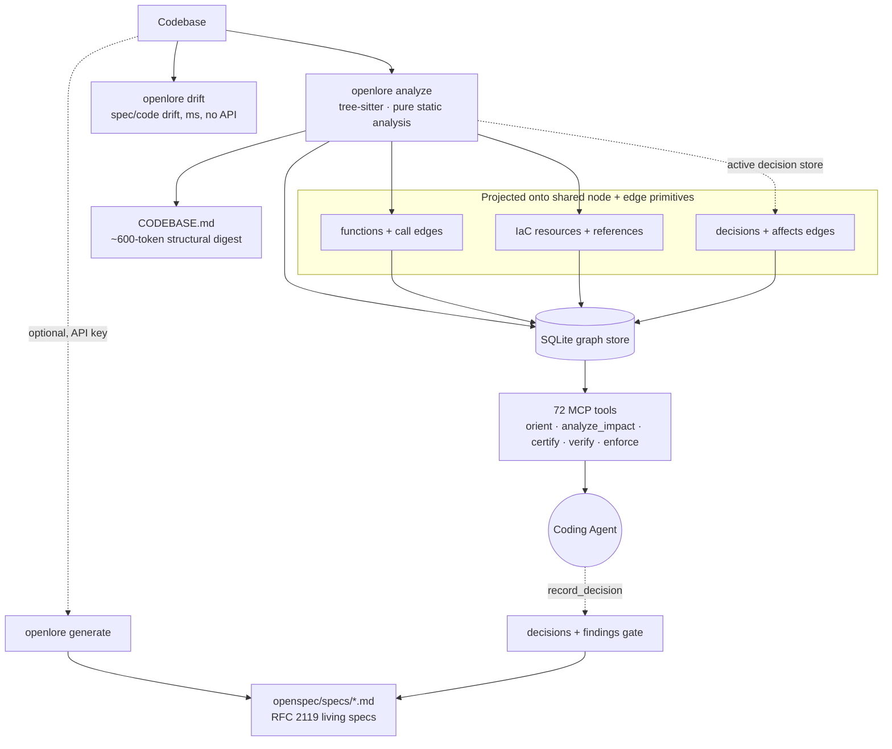

<h1 align="center">OpenLore</h1>

<p align="center">
  <strong>Deterministic, local-first memory and guardrails for AI coding agents — with no LLM in the hot path.</strong><br>
  One call tells your agent the code a task touches; one gate tells it what's unsafe to change.<br>
  Grounded in static analysis. No API key. Same answer every time.
</p>

<p align="center">
  <a href="https://www.npmjs.com/package/openlore"></a>
  <a href="https://github.com/clay-good/OpenLore/actions/workflows/ci.yml"></a>
  <a href="LICENSE"></a>
  =22.5">
  <br>
  
  
  
  
  <a href="https://github.com/clay-good/OpenLore/stargazers"></a>
</p>

<p align="center">
  
</p>

<p align="center"><em>The whole lifecycle on a real repo, straight from the terminal — no edits, no narration. <strong>Install</strong> in one command (no API key) → <strong>orient</strong> finds the code a task touches → <strong>blast-radius</strong> flags a risky change before you commit → <strong>prove</strong> projects the payoff on <em>your</em> repo. Deterministic and local.</em></p>

<p align="center">
  <strong><a href="#install-in-one-command">Install</a> · <a href="#what-you-get">What you get</a> · <a href="#does-it-pay-for-itself">Benchmarks</a> · <a href="#governance--guardrails-on-what-your-agent-changes">Governance</a> · <a href="#how-it-works">How it works</a> · <a href="#openlore-vs-alternatives">vs. Alternatives</a> · <a href="#documentation">Docs</a></strong>
</p>

---

AI coding agents are powerful but **amnesiac and ungoverned**. Every task starts by re-reading the same files to rediscover structure; every long session quietly drifts toward confident-but-stale assumptions; and nothing tells the agent when a change is about to break a contract, cross an architectural boundary, or open a path into sensitive code.

OpenLore fixes both halves. It runs a **one-time static analysis** of your codebase and keeps a navigable knowledge graph — call structure, types, tests, decisions, IaC, and spec drift — incrementally fresh as you edit. Agents query it through **MCP tools** (or the CLI) to start every task already oriented, and to certify a change *before* it lands. It is **deterministic and local-first** — no LLM in the hot path — so the same question returns the same grounded answer, and an agent is *told when a fact has gone stale* instead of served a confident guess.

## Install in one command

```bash
npm install -g openlore && openlore install
```

That one command **auto-detects your agent** (Claude Code, Cursor, Cline, Continue, AGENTS.md), **wires it to call `orient()` automatically**, **registers the MCP server**, and **builds the index** — no API key, no config, no questions asked. Then ask your agent:

> **`orient("add a payment method")`**

…and it begins the task already knowing the relevant functions, their callers, the matching specs, the tests, and the risk of changing each one — in a single call. Full setup, variants, and verification: [5-Minute Quickstart](#5-minute-quickstart).

---

## What you get

OpenLore does two things for an agent, both deterministic and local — it **remembers** your architecture so every task starts oriented, and it **governs** what the agent changes before the change lands.

**🧠 Memory — start every task already oriented**

- **Persistent architectural memory** — `orient()` once; agents stop re-deriving the system from dozens of file reads, across sessions. Anchored notes and decisions **survive refactors**: a renamed or moved symbol carries its memory forward at the next `analyze` (with `carriedAcross` provenance) instead of orphaning it.
- **One-call orientation** — `orient(task)` returns the relevant functions, their callers, matching spec sections, and insertion-point candidates in a single call. **~430µs p50** on a 15k-node graph.
- **One unified graph** — application code, **Infrastructure-as-Code**, and **architectural decisions** all project onto the same node/edge primitives, so a single traversal answers questions that span all three.
- **Test-impact selection & dead-code** — "I changed `parseConfig()` — which tests should I run?" by backward call-graph reachability; cross-language mark-and-sweep finds what's dead, confidence-tagged, never deletion authority.
- **Context-freshness tracking (Epistemic Lease)** — an agent is *told* when a cached fact has gone stale (context aged, repo moved) instead of acting on a confident guess.

**🛡️ Governance — guardrails on what the agent changes**

- **Change-impact certificate** — `change_impact_certificate` flags when a diff **newly opens a path into a sensitive boundary you declared** (reachable after the change but not before) — differential, deterministic, no LLM.
- **Breaking-change verdict** — `certify_public_surface` classifies every changed export `breaking / non-breaking / potentially-breaking` over a diff and names the in-repo consumers each break hits; conservative by construction, never silently "safe".
- **Architecture invariants, pre-edit** — `check_architecture` answers "may a file under A import B?" against your declared layer/forbidden rules *before* the import is written — cross-language.
- **Grounded claims, not guesses** — `verify_claim` returns a deterministic `confirmed / refuted / unverifiable` verdict with a citation receipt before an agent asserts "X is dead" or "Y is safe to change".
- **One commit gate** — `openlore enforce` resolves every governance finding through your `enforcement.policy` and blocks only on what you class `blocking` (advisory by default, no API key). Decisions are recorded, gated, and synced into living specs; spec/code **drift detected in milliseconds**.

**📊 Honest by construction** — **−26% agent round-trips** on deep traces in large repos, with the losses published next to the wins; every public claim traces to a command you can run. Pure static analysis: no API key, no network, same answer every time.

---

## See it in action

<details open>
<summary><strong>orient("add a payment method")</strong> — one query replaces most exploratory file reads</summary>

```json
{
  "functions": [
    {
      "name": "processPayment",
      "file": "src/payments/processor.ts",
      "risk": "medium",
      "fanIn": 4,
      "callers": ["handleCheckout", "retryFailedCharge"],
      "callType": "direct"
    },
    {
      "name": "validateCard",
      "file": "src/payments/validator.ts",
      "risk": "low",
      "fanIn": 1,
      "testedBy": [{ "name": "validateCard.test.ts", "confidence": "called" }]
    }
  ],
  "specDomains": ["payments — §CardValidation, §PaymentFlow"],
  "insertionPoints": [
    "src/payments/processor.ts:87 — after existing charge logic"
  ],
  "callPath": "POST /charge → handleCheckout → processPayment → validateCard → stripeClient.charge"
}
```

The agent knows exactly where to look, what it touches, and what risks to consider — before reading a single file.

</details>

<details>
<summary><strong>Gate a risky change before it lands</strong> — deterministic, in CI or a pre-commit hook</summary>

```bash
openlore impact-certificate --base main      # does my diff open a new path into a declared sensitive boundary?
openlore certify-public-surface --base main  # did I break a consumer's public API contract?
openlore blast-radius                        # callers/layers touched, tests to run, specs & decisions that drift
openlore enforce --hook                       # one gate; blocks only on findings you've classed `blocking`
```

No LLM, no API key — the same grounded answer every run. Advisory by default; you opt into blocking per finding.

</details>

---

## Does it pay for itself?

OpenLore only earns its place if an agent **with** it reaches a correct answer for less total cost than the same agent **without** it. We measure that inequality and publish it — wins **and** losses. Numbers are from the Spec 14 agent benchmark (`claude -p`, sonnet, N=4 medians, pinned SHAs, `--strict-mcp-config` isolating each arm), measured **2026-06-01**.

| Scenario (task × repo) | Cost Δ | Round-trips Δ | Correctness | Verdict |
|---|---|---|---|---|
| **Large/unfamiliar repo · deep "how does X flow through Y"** *(its target)* | **−7% to −21%** | **−26%** | 100% = 100% | ✅ helps — and the win grows with repo size |
| Small/familiar repo · shallow "who calls X" | **task-dependent** *(Round 1: +43%)* | **+38%** | 100% = 100% | ❌ often adds overhead — measure with `openlore prove` |

Deep-trace detail — the win scales with codebase size (cost Δ; round-trips WITHOUT → WITH):

| Repo (size) | Cost Δ | Round-trips |
|---|---|---|
| excalidraw (~640 files) | **−21%** | 25 → 16 |
| tokio (~790 files) | **−21%** | 17 → 13 |
| okhttp | **−13%** | 13 → 11 |
| django (~3k files) | **−7%** | 21 → 15 |
| gin (110 files, smallest) | +4% *(≈even)* | 10 → 9 |

**Where it helps — and where it doesn't:**
- **Helps:** large, unfamiliar, or private codebases the model hasn't memorized; deep multi-hop questions; long sessions where re-reading an ever-growing context compounds. The hardest-to-game signal is **round-trips: −26%, fewer on every deep task.**
- **Doesn't (yet):** small, famous repos already in the model's weights answered by a shallow query — there's no orientation tax to remove, so the tool surface is pure overhead.

> **Honesty contract.** We never publish a savings number the benchmark didn't produce; we always show the loss cases next to the wins; the scorecard is date-stamped and re-measured after each optimization phase. Every public token claim traces to a command you can run in this repo — if it doesn't reproduce, treat it as marketing and call it out. Full methodology and per-task numbers: [docs/AGENT-BENCHMARKS.md](docs/AGENT-BENCHMARKS.md). Plumbing latency (orient ~430µs p50) is separate and real: [scripts/BENCHMARKS.md](scripts/BENCHMARKS.md).

> **Prove it on your repo — no API key needed.** `openlore prove --estimate` projects the orientation tax from your own call graph in seconds (zero API key, zero network); plain `openlore prove` runs the full measured WITH/WITHOUT pass (needs `claude` + a key). Add `--json` (CI-consumable), `--markdown` (a paste-ready scorecard block + a shields.io badge for your README), or `--save` (a dated record under `.openlore/prove/`). An estimate is labeled `estimate` everywhere and never presented as a measurement. Details: [docs/AGENT-BENCHMARKS.md](docs/AGENT-BENCHMARKS.md#openlore-prove--measure-or-estimate-it-on-your-repo).

---

## 5-Minute Quickstart

```bash
npm install -g openlore
cd /path/to/your-project

openlore install          # detect your agent, wire it up, AND build the index
```

That single command:

1. **Auto-detects** which agent surfaces are present (Claude Code, Cursor, Cline, Continue, AGENTS.md) and wires each one to call `orient()` — no manual `CLAUDE.md` editing.
2. **Registers the MCP server** so it starts automatically when your agent launches (you don't run `openlore mcp` yourself).
3. **Builds the index** (`init` + `analyze` → a keyword/BM25 graph, no network needed) so `orient()` returns real results in your very first session.
4. **Wires task-scoped orientation** (Claude Code): a `UserPromptSubmit` hook orients each new prompt and injects a bounded, ignorable orientation block *before* the first turn — so the common task begins already oriented without a manual `orient()` call. A deterministic relevance gate keeps it out of the small/familiar case; disable with `contextInjection.mode: "off"`.

```bash
openlore install --no-analyze   # wire surfaces only; build the index later
openlore install --dry-run      # preview every change without writing
openlore doctor                 # verify config, index, MCP wiring, and embedding setup
```

**Zero-interaction by design.** Nothing prompts you and nothing touches your repo on `npm install`. `openlore install` never asks a question. And if an agent wires the MCP server *without* a prior install, the server **self-bootstraps** — it builds the index once in the background on first run (opt out with `OPENLORE_NO_AUTO_ANALYZE=1`).

**Stays current automatically.** A once-a-day, non-blocking "update available" line; upgrade with **`openlore update`** (detects npm vs. Homebrew vs. npx). Silence with `OPENLORE_NO_UPDATE_NOTIFIER=1`. The MCP server keeps the index fresh as you edit (file watcher on by default; build dirs like `target/`, `node_modules/`, `dist/` are pruned automatically). See [docs/install.md](docs/install.md).

**Full pipeline** (specs + decisions — optional and additive):

```bash
openlore generate         # generate living specs (requires API key)
openlore drift            # detect spec/code drift (no API key)
openlore decisions        # manage architectural decisions
```

<details>
<summary>Install from source</summary>

```bash
git clone https://github.com/clay-good/openlore
cd openlore
npm install && npm run build && npm link
```

</details>

<details>
<summary>Nix / NixOS</summary>

```bash
nix run github:clay-good/openlore -- analyze
nix shell github:clay-good/openlore
```

System flake:
```nix
environment.systemPackages = [ openlore.packages.x86_64-linux.default ];
```

</details>

> Migrating from `spec-gen`? The package is now [`openlore`](https://www.npmjs.com/package/openlore) and the command is `openlore` — see [docs/RENAME-TO-OPENLORE.md](docs/RENAME-TO-OPENLORE.md) for the short checklist.

---

## Governance — guardrails on what your agent changes

Memory makes an agent fast. Governance makes it *safe*. As agents get more autonomous, the bottleneck moves from "can it write the code" to "can I trust what it just changed." OpenLore answers that **deterministically** — every check below is static analysis, no LLM, **advisory by default with opt-in blocking** — and all of it rides the one graph, so it spans application code, IaC, and your recorded decisions at once.

| Guardrail | What it certifies | Run it |
|---|---|---|
| **`change_impact_certificate`** | Whether a diff **newly opens a path into a sensitive boundary you declared** — reachable *after* the change but not before (a differential, not a snapshot) — plus blast radius, drifted specs, and the tests to run. | `openlore impact-certificate --base main` |
| **`certify_public_surface`** | A breaking-change verdict over a diff: each changed export `breaking / non-breaking / potentially-breaking`, each break paired with the in-repo consumers it hits. Conservative — what it can't prove safe is never called safe. | `openlore certify-public-surface --base main` |
| **`check_architecture`** | "May a file under A import B?" against your declared layer / forbidden / allowed-only rules — a **pre-write** verdict, cross-language, instead of a post-hoc CI failure. | declare rules in `.openlore/architecture.json` |
| **`verify_claim`** | A deterministic `confirmed / refuted / unverifiable` verdict **with a citation receipt** before an agent asserts "X is dead", "Y is safe to change", or "decision `abc12345` still governs this". | MCP tool (`verify` preset) |
| **`openlore enforce`** | One commit gate over **every** governance finding. Map each finding `code` → `blocking / advisory / off` in `enforcement.policy`; the gate blocks only on what you class blocking. | `openlore enforce --hook` |
| **Epistemic Lease** | Tells the agent when its context has gone stale (aged, or the repo moved) so a long session can't drift onto confident-but-wrong assumptions. **Facts, never commands.** | automatic on every MCP response |

A reviewer doesn't even need an agent: **`openlore review --base main`** composes the structural delta and the blast radius into one Markdown briefing, and the bundled GitHub Action posts it as a single sticky PR comment (advisory by default). See [PR review](#pr-review-no-agent-required).

---

## Agent Cheat Sheet

The default MCP surface is the lean **`navigation`** preset — 10 tools, the Spec 14 benchmark winner; the full surface of **72 tools** is opt-in via `--preset full`. Every tool declares one of six **capability families** — `navigate` · `change` · `remember` · `verify` · `coordinate` · `federate` — surfaced in its MCP `annotations.family`, so a wide surface stays discoverable by family rather than as a flat list. Reach for the right tool by situation:

| Situation | Tool |
|-----------|------|
| Starting any task | `orient(task)` — functions, callers, specs, insertion points in one call |
| Shallow "who calls X / where is Y?" | `orient(task, lean:true)` — navigation core only, ~40% smaller |
| "Which file/function handles X?" | `search_code` |
| "What's the blast radius if I change this?" | `analyze_impact` — risk score + up/downstream chain + **governing decisions** |
| "How does request X reach function Y?" | `trace_execution_path` |
| "I changed X — which tests should I run?" | `select_tests` — backward reachability to the reaching tests + paths |
| "What's dead / what dies if I delete X?" | `find_dead_code` — cross-language reachability, confidence-tagged |
| "What's the blast radius of my whole diff before I commit?" | `blast_radius` — callers/layers, tests to run, anchored memories & specs that drift |
| "Does my diff open a new path into a sensitive boundary?" | `change_impact_certificate` — differential reachability into declared surfaces |
| "Did my change break a consumer's public API contract?" | `certify_public_surface` — breaking-change verdict, consumers named |
| "May I add this import here?" | `check_architecture` — pre-edit verdict against declared rules |
| About to assert a fact / cite a decision | `verify_claim` — deterministic verdict + citation receipt |
| Recording an architectural choice | `record_decision` **before** writing the code |
| "What changed structurally / whose callers are stale?" | `structural_diff` — graph diff, stale callers, rename flags |
| "What changes together with this / what's volatile?" | `get_change_coupling` — co-change + churn from git |
| Reading / checking a spec | `get_spec` · `search_specs` · `check_spec_drift` |
| "A lot changed since I last looked — what matters?" | `briefing_since` — changed symbols ranked by structural significance |
| "Does a near-duplicate of this already exist to reuse?" | `find_clones` — edit-time, scoped clone query |

Everything else (read a file, grep, list files) uses your native tools. Full reference — all 72 tools and parameters: [docs/mcp-tools.md](docs/mcp-tools.md).

### Use OpenLore as a Claude Code Skill

OpenLore ships a canonical [Claude Code Skill](https://docs.claude.com/en/docs/claude-code/skills) at [`skills/openlore-orient/`](skills/openlore-orient/). Install it once and Claude Code calls `orient()` at the start of every task — no `CLAUDE.md` editing.

```sh
npm run skill:install-local           # → ~/.claude/skills/openlore-orient/
cp -R skills/openlore-orient /path/to/your-project/.claude/skills/   # or per-project
```

The 8 multi-agent **workflow** skills (brainstorm, plan-refactor, write-tests, review-changes, debug, …) install via `openlore setup` into `.claude/`, `.opencode/`, or `.vibe/`. See [`skills/openlore-orient/README.md`](skills/openlore-orient/README.md).

---

## OpenLore vs. Alternatives

| | Cursor / Claude Code | Sourcegraph | OpenLore |
|---|---|---|---|
| Graph-aware MCP context | ❌ file-based reads | Partial | ✓ call graph + clusters |
| Persistent cross-session architectural memory | ❌ | Partial | ✓ |
| Token-efficient `orient()` | ❌ | ❌ | ✓ −7%→−21% cost, −26% round-trips on deep tasks † |
| Change-impact certificate (paths into sensitive boundaries) | ❌ | ❌ | ✓ deterministic, pre-commit |
| Breaking-change verdict over a diff | ❌ | ❌ | ✓ consumers named |
| Architecture invariants, pre-edit | ❌ | ❌ | ✓ cross-language |
| Governance commit gate (decisions + findings) | ❌ | ❌ | ✓ `enforcement.policy` |
| Spec/code drift detection | ❌ | ❌ | ✓ milliseconds, no API |
| Long-session confidence decay (Epistemic Lease) | ❌ | ❌ | ✓ |
| Offline structural analysis, no LLM in the hot path | ❌ | ❌ | ✓ |

† **Measured, and it depends on the task** — full numbers in [Does it pay for itself?](#does-it-pay-for-itself). Small/familiar repos + shallow queries *add* overhead; larger codebases + deep questions are a net win (−7%→−21% cost, −26% tool-calls, scaling with repo size), at 100% answer correctness in both arms. The savings hold where OpenLore is designed to help, not on toy queries.

---

## How It Works

Three layers, each usable independently:

| Layer | What it does | API key? |
|-------|-------------|----------|
| **1. Static Analysis** | Call graph, clusters, McCabe CC, IaC, external deps → `CODEBASE.md` digest | No |
| **2. Spec & Governance** | Living specs, ADRs, drift detection, change certificates, decision & finding gates | For spec *generation* only |
| **3. Agent Runtime** | 72 MCP tools — `orient()`, graph traversal, semantic search, verdicts & gates | No |

Use layer 1 alone for structural context. Add layer 2 for semantic intent and governance. Layer 3 keeps it all continuously accessible through graph-native MCP tools once `openlore mcp` is running.



Crucially, application code, Infrastructure-as-Code, and architectural **decisions** all project onto one shared set of node/edge primitives — so a single traversal answers questions that span all three, and impact analysis returns governance as a graph neighbor. See [docs/ARCHITECTURE.md](docs/ARCHITECTURE.md).

---

## Core Features

**Analyze** *(no API key)* — Continuously maintains a structural representation using pure static analysis: a full call graph in SQLite, label-propagation community detection, McCabe complexity per function, and extracted DB schemas, HTTP routes, UI components, middleware, and env vars. Outputs `.openlore/analysis/CODEBASE.md` — a ~600-token digest that compresses tens of thousands of exploratory tokens. With `--watch-auto` the graph updates incrementally on every save and **converges to what `analyze --force` would produce**; when a change's reverse-dependency closure exceeds the per-save budget, the un-recomputed files are marked **explicitly stale** rather than left silently divergent.

**Generate** *(API key)* — Sends the analysis to an LLM in 6 structured stages (survey → entities → services → APIs → architecture → ADRs), producing `openspec/specs/` living specifications in RFC 2119 with Given/When/Then scenarios.

**Drift** *(no API key)* — Compares git changes against spec mappings in milliseconds: Gap, Uncovered, Stale, and ADR-gap. Installs as a pre-commit hook. → [docs/drift-detection.md](docs/drift-detection.md)

**Test impact selection** *(no API key)* — `select_tests` walks the call graph **backward** from a change to every test that transitively reaches it, returning each test with its reaching path. Static, call-graph-based regression test selection at edit time, not after CI. An honest over-approximate prioritizer ("run these first"), not a sound replacement for the full suite. → [docs/test-impact-selection.md](docs/test-impact-selection.md)

**Reachability & dead-code** *(no API key)* — `find_dead_code` runs cross-language mark-and-sweep from roots (tests, imports, route handlers, `main`), and answers "what becomes dead if I delete X?" Results are **confidence-tagged candidates, never deletion authority**. The import resolver follows re-export/barrel chains and Python relative imports so a call resolves precisely. → [docs/reachability-dead-code.md](docs/reachability-dead-code.md)

**Change-impact certificate** *(no API key)* — `change_impact_certificate` certifies whether a diff **newly opens a path into a declared covering surface** (differential reachability — reachable after but not before), plus blast radius, drifted specs, and tests to run. Decays via the freshness lease. Advisory; opt-in blocking on a configured surface severity. CLI: `openlore impact-certificate`.

**Public API surface contract** *(no API key, opt-in)* — `certify_public_surface` gives a deterministic breaking-change verdict over a diff: each changed export `breaking / non-breaking / potentially-breaking`, each break paired with the in-repo consumers it hits. Conservative — a change it can't prove compatible is `potentially-breaking`, never silently safe. Renamed exports detected via symbol-identity continuity. CLI: `openlore certify-public-surface`.

**Architecture invariant guardrails** *(no API key)* — `check_architecture` turns an architectural rule from a post-hoc CI failure into a **pre-write** verdict. Declare `layers` / `forbidden` / `allowedOnly` in `.openlore/architecture.json` (or via an `Invariant:` marker on a synced ADR), and the tool answers "may a file under A import B?" with a deterministic verdict + the governing rule. Cross-language over the unified graph. → [docs/architecture-invariants.md](docs/architecture-invariants.md)

**Claim verification** *(no API key, opt-in)* — `verify_claim` returns `confirmed / refuted / unverifiable` with a citation receipt (index commit, content hashes, the reaching path) — never an LLM guess. Structural kinds check the call graph; `decision-current` checks a recorded decision is still authoritative and names the live superseder if it isn't.

**Finding enforcement** *(no API key, advisory by default)* — `openlore enforce` is the **unified gate over all governance findings**. A single `enforcement.policy` block maps each finding `code` → `blocking / advisory / off`, decoupling a finding's intrinsic severity from your risk posture. The `--hook` gate fails a commit only on a `blocking` finding; a repo that declares no policy never blocks. It always runs the deterministic `stale-decision-reference` check and folds in blast-radius and impact-certificate findings where configured. → [docs/configuration.md](docs/configuration.md#enforcement-policy)

**Decisions on the graph** *(API key for consolidation)* — Agents call `record_decision` before writing code; a pre-commit hook gates the commit until verified decisions are reviewed and written back as requirements. Decisions are also **first-class graph nodes**: projected into `decision::<id>` nodes joined to the files they govern by `affects` edges, so `analyze_impact` and `get_subgraph` return the governing decisions of a symbol and its blast radius as typed neighbors. → [docs/specs/openlore-spec-16-decisions-as-graph-nodes.md](docs/specs/openlore-spec-16-decisions-as-graph-nodes.md)

**Epistemic Lease** *(no API key)* — Models architectural drift as a **navigation** phenomenon, not a knowledge one: decay is driven by where the agent goes (cross-module trajectory), time since `orient()`, and weighted cognitive load. Once context ages or the repo moves, every MCP response carries a brief, **factual** freshness note — *"informational signal; you decide whether to act on it"* — never a command. Calling `orient()` resets it; when fresh, injection is zero-overhead.

**Structural change analysis** *(no API key)* — `structural_diff` is the structural complement to `git diff`: functions and edges added/removed, signature changes, and the callers in *other* files now **stale** because a callee's signature moved. → [docs/structural-diff.md](docs/structural-diff.md)

**Change-coupling & volatility** *(no API key)* — `get_change_coupling` mines two facts the call graph can't see: co-change coupling ("these files always change together" — invisible coupling with no import edge) and churn ("changed 23 times" — a risk flag). Advisory, correlation not causation. → [docs/change-coupling.md](docs/change-coupling.md)

**Test-coverage gaps** *(no API key, opt-in)* — `report_coverage_gaps` answers the inverse of `select_tests`: **which load-bearing code has no test reaching it at all?** Walks forward from every test, reports the code *outside* that set, ranked by hub/chokepoint significance. No test run, no instrumentation. Gaps-only and honest — it never claims a symbol is "tested". CLI: `openlore coverage-gaps`. → [docs/coverage-gaps.md](docs/coverage-gaps.md)

<details>
<summary>More tools — style fingerprint, clone query, error & env-var impact, change briefing, parallel-work planning…</summary>

- **`get_style_fingerprint`** — a descriptive, deterministic idiom profile (arrow vs. declared function, `const`/`let`, naming case…) so an agent matches the house style. Honest by construction: a counter below the evidence floor, or a choice the compiler enforces, reports a null signal, never a guess.
- **`find_clones`** — the edit-time, scoped "does a near-duplicate of *this* already exist?" companion to the whole-repo `get_duplicate_report`. One query (a symbol or a raw snippet), clones ranked exact > structural > near. CLI: `openlore find-clones`.
- **`analyze_error_propagation`** — the exceptions that escape a function vs. those caught within it (TS/JS/Python). A sound lower bound — un-analyzable callees disclosed, never assumed exception-free. CLI: `openlore error-propagation`.
- **`analyze_env_impact`** — "what breaks if I remove this env var?": line-precise read sites, the upstream callers that reach them, tests to run, and per-site `required`. CLI: `openlore env-impact`.
- **`briefing_since`** — the catch-up lens: changed symbols since a base ref, ranked into a fixed tier order (surprising-change > hub-change > chokepoint-change > ordinary) from existing classifiers, no weighted score. CLI: `openlore briefing-since`.
- **`plan_parallel_work` / `map_in_flight_conflicts`** — a hazard-typed conflict graph over a task list, or over every in-flight branch/PR/agent-task, with a suggested landing order (opt-in `coordination` preset).
- **`get_language_support`** — the deterministic per-language capability matrix, derived from the live extractors so it can't over-claim. → [docs/language-support.md](docs/language-support.md)

</details>

**Preflight** *(no API key)* — A CI staleness gate: any PR that edits indexed files fails until the graph is refreshed, weighted so hubs surface first. Drop-in templates in [`examples/ci/`](examples/ci/). → [docs/preflight.md](docs/preflight.md)

**Share the index** *(no API key)* — The graph is a deterministic function of the committed source, so a team analyzes **once** and everyone else imports. `openlore export bundle` serializes the index into a portable, integrity-stamped `.olbundle`; `openlore import` bootstraps a verified index in seconds — **validate-or-rebuild**, never serving a stale or tampered bundle. → [docs/shareable-bundle.md](docs/shareable-bundle.md)

**Telemetry** *(opt-in, no API key)* — Gated by `OPENLORE_TELEMETRY=1` (off by default). Append-only JSONL under `.openlore/telemetry/` for empirically measuring Epistemic Lease behavior (obstinacy index, recovery efficiency, trajectory dynamics). Analyze with `openlore telemetry`.

---

## Languages & Infrastructure-as-Code

**Languages**: TypeScript · JavaScript · Python · Go · Rust · Ruby · Java · C++ · Swift · C# · Kotlin · PHP · C · Scala · Dart · Lua · Elixir · Bash — call graphs ride the same node/edge primitives for every language. Per-language extraction limits: [docs/languages.md](docs/languages.md).

**Infrastructure-as-Code**: Terraform/HCL · Kubernetes · Helm · CloudFormation · Ansible · Pulumi · AWS CDK · CDKTF · Dockerfile · Docker Compose · GitHub Actions · Azure Bicep — IaC resources and their references project onto the **same graph** as application code, so `orient`, `search_code`, and `analyze_impact` answer "what's the blast radius of changing this security group / ConfigMap / IAM role / base image / CI job?" with zero new tooling. A compose service's `build:` resolves to its Dockerfile stage to its `FROM` base image — so one `analyze_impact` on a base image surfaces every stage and service that would rebuild. → [docs/iac.md](docs/iac.md)

**Cross-domain impact**: for embedded IaC (Pulumi/CDK/CDKTF), the code that provisions a resource is linked to it by a `references` edge, so `analyze_impact` traverses the code↔infra boundary **end-to-end** — "what infrastructure does this handler reach?" and the reverse. A code-only navigator structurally cannot answer this. → [docs/cross-domain-impact.md](docs/cross-domain-impact.md)

---

## Federation, Interop & PR review

### Federation (cross-repo)

The hardest orientation questions cross repo boundaries: who calls `BillingService.refund`, where is event `X` consumed, how does data flow from service A to B. Each repo keeps its own independently-built `.openlore` index; a project-local registry references peers, and federated queries load only what they need — **no merged graph is ever materialized**.

```bash
openlore federation add ../billing-service --name billing   # register a peer repo's index
openlore federation list                                     # ✓ indexed / ⚠ stale / ∅ unindexed
```

`analyze_impact`, `find_dead_code`, `select_tests`, and `find_path` take an opt-in `federation` flag and answer across the fleet — always naming the repos consulted vs skipped, never guessing for an unindexed one. `analyze_impact` on a route handler additionally surfaces its **cross-service consumers** — client call sites in *other* services that target the endpoint, matched by normalized route key. Enable with `openlore mcp --preset federation`. → [docs/federation.md](docs/federation.md) · [docs/cross-service-topology.md](docs/cross-service-topology.md)

### PR review (no agent required)

OpenLore's deterministic value usually flows through an agent calling an MCP tool — but **everyone opens pull requests**. `openlore review` drops the same distinctive output into that workflow, no agent required:

```bash
openlore review --base main           # one Markdown briefing for a base..head range
openlore review --format json         # machine-readable, for any CI / forge
```

It composes the **structural delta** (`structural_diff`) and the **blast radius** (hubs touched, layers crossed, tests to run, spec/decision/memory drift) into one comment. The bundled **GitHub Action** posts it as **one sticky comment** — created once, updated in place, never spammy — advisory by default. Adoption is one workflow file: [`.github/workflows/openlore-review.yml.example`](.github/workflows/openlore-review.yml.example). → [docs/cli-reference.md](docs/cli-reference.md#pr-review-openlore-review)

### Interop (SCIP)

OpenLore exports [SCIP](https://github.com/sourcegraph/scip). Plug it into Sourcegraph code nav, GitHub stack graphs, Glean importers, or any SCIP-aware tool:

```bash
openlore analyze && openlore export scip   # writes ./index.scip
```

The SQLite graph stays canonical; SCIP is a one-way export of the subset it can model. → [docs/scip-export.md](docs/scip-export.md)

### OpenSpec plugin (marketplace)

**OpenLore is the inaugural engine and reference plugin** for the OpenSpec marketplace: generate specs from existing code, then hand evolution back to core OpenSpec. OpenSpec discovers OpenLore by a declarative plugin manifest and invokes it as a **subprocess** — it never imports OpenLore's code. → [docs/OPENSPEC-INTEGRATION.md](docs/OPENSPEC-INTEGRATION.md)

---

## We dogfood our own governance

OpenLore's architecture is governed by the same decision system it ships. These ADRs were recorded with `record_decision`, gated at commit, synced into `openspec/specs/`, and projected onto the graph — they are the live, load-bearing constraints behind the design, not aspirational docs.

| Decision | Rationale | Where |
|----------|-----------|-------|
| **North star is a deterministic structural context substrate** | Local-first plumbing (like tree-sitter/SCIP/LSP) agents build on; every feature must make the coding-agent case more useful and stay grounded in static analysis, not LLM guessing | [ADR-0001](openspec/decisions/adr-0001-north-star-is-a-deterministic-structural-context-s.md) |
| **IaC resources project onto the existing graph primitives** | One projector maps infrastructure onto `FunctionNode`/`CallEdge` so every MCP tool works on IaC with zero new tooling | `src/core/analyzer/iac/project.ts` |
| **Decisions project onto the graph the same way** | A parser→projector split turns the decision store into `decision::` nodes + `affects` edges — governance becomes a deterministic graph join | `src/core/decisions/project.ts` |
| **EdgeStore uses SCHEMA_VERSION rebuild-on-bump, not migrations** | The graph is fully derivable from source, so a schema change drops and rebuilds — no migration code, no drift | `src/core/services/edge-store.ts` |
| **BM25 keyword retrieval is the zero-network floor** | `orient`/`search_code` work with no API key or embedding server; dense embeddings are an optional upgrade | Spec 06 |
| **The default MCP surface is the lean `navigation` preset** | A lean graph-traversal surface wins the Spec 14 agent benchmark, so `openlore install` wires it by default; the full set is one opt-in away | Spec 14 |

This is the live decision log the pre-commit gate enforces. See [docs/governance-dogfooding.md](docs/governance-dogfooding.md).

---

## Known Limitations

We'd rather you know these up front than discover them mid-task.

- **Incremental updates converge or flag, never silently diverge.** The watcher re-indexes the changed file's reverse-dependency closure on save; when that exceeds the per-save budget (default 40 files) the un-recomputed files are marked **explicitly stale** (freshness verdicts report non-authoritative) instead of left wrong. A full `analyze --force` clears the region.
- **The index is integrity-checked, never served half-built.** Every `analyze` writes an attestation (schema version, counts, content digest); on load the store is reconciled into `healthy` / `degraded` / `mismatched`, and a non-healthy index is disclosed in the conclusion tools whose soundness depends on completeness — never silently answered over.
- **Static analysis only.** Dynamic dispatch, runtime metaprogramming, and `eval`-based patterns are not captured in the call graph.
- **LLM spec quality varies.** Generated specs reflect the model's understanding — review complex business logic before treating it as authoritative.
- **Keyword (BM25) is the first-class default; semantic is an opt-in upgrade.** `orient`/`search_code` work immediately with no API key. Upgrade to hybrid dense+BM25 with `openlore embed --local` (a bundled, CPU-only, no-API-key on-device embedder, ~23 MB pinned model) or a remote `EMBED_BASE_URL`. Each surface states its active mode (`keyword` / `local-semantic` / `remote-semantic`).
- **Large monorepos** may take several minutes to `analyze` — the AST/symbol-extraction pipeline is the bottleneck, not graph storage.

---

## Requirements

- **Node.js 22.5+** (launching under an older Node fails fast with a one-line message and exit code 78, never a stack trace).
- **No API key** for `analyze`, `drift`, `mcp`, `init`, and every governance/navigation tool.
- **API key** only for `generate`, `verify`, and `drift --use-llm`:
  ```bash
  export ANTHROPIC_API_KEY=sk-ant-...    # default provider
  export OPENAI_API_KEY=sk-...           # OpenAI
  export GEMINI_API_KEY=...              # Google Gemini
  ```
  …or use a CLI-based provider (`claude-code`, `gemini-cli`, `mistral-vibe`, `cursor-agent`) — no key, just the CLI on your PATH.

---

## Documentation

| Topic | Doc |
|-------|-----|
| MCP tools reference (72 tools + parameters) | [docs/mcp-tools.md](docs/mcp-tools.md) |
| `openlore install` — auto-configure agent surfaces | [docs/install.md](docs/install.md) |
| Agent setup (Claude Code, Cline, OpenCode, Vibe…) | [docs/agent-setup.md](docs/agent-setup.md) |
| Agent benchmarks (methodology + per-task numbers) | [docs/AGENT-BENCHMARKS.md](docs/AGENT-BENCHMARKS.md) |
| LLM providers + embedding config | [docs/providers.md](docs/providers.md) |
| Language support + the "add a language" checklist | [docs/language-support.md](docs/language-support.md) |
| Configuration reference (incl. `enforcement.policy`) | [docs/configuration.md](docs/configuration.md) |
| Change-impact certificate & surfaces | [docs/cli-reference.md](docs/cli-reference.md) |
| Architecture invariant guardrails (pre-edit) | [docs/architecture-invariants.md](docs/architecture-invariants.md) |
| Test impact selection (which tests to run) | [docs/test-impact-selection.md](docs/test-impact-selection.md) |
| Reachability & dead-code analysis | [docs/reachability-dead-code.md](docs/reachability-dead-code.md) |
| Test-coverage gaps (untested surface) | [docs/coverage-gaps.md](docs/coverage-gaps.md) |
| Structural change analysis (graph diff) | [docs/structural-diff.md](docs/structural-diff.md) |
| Change-coupling & volatility (git-mined) | [docs/change-coupling.md](docs/change-coupling.md) |
| Drift detection in depth | [docs/drift-detection.md](docs/drift-detection.md) |
| Cross-domain impact (code ↔ infrastructure) | [docs/cross-domain-impact.md](docs/cross-domain-impact.md) |
| Cross-service topology (federation) | [docs/cross-service-topology.md](docs/cross-service-topology.md) |
| Federation manifest (cross-repo) | [docs/federation.md](docs/federation.md) |
| Shareable graph bundle (export/import the index) | [docs/shareable-bundle.md](docs/shareable-bundle.md) |
| SCIP export (Sourcegraph/Glean interop) | [docs/scip-export.md](docs/scip-export.md) |
| Preflight CI staleness gate | [docs/preflight.md](docs/preflight.md) |
| CI/CD integration | [docs/ci-cd.md](docs/ci-cd.md) |
| Local provenance (git/PR, no OAuth) | [docs/provenance.md](docs/provenance.md) |
| CLI command reference | [docs/cli-reference.md](docs/cli-reference.md) |
| Interactive graph viewer | [docs/viewer.md](docs/viewer.md) |
| Configuration · Programmatic API · Pipeline | [docs/configuration.md](docs/configuration.md) · [docs/api.md](docs/api.md) · [docs/pipeline.md](docs/pipeline.md) |
| Internal design · Algorithms | [docs/ARCHITECTURE.md](docs/ARCHITECTURE.md) · [docs/ALGORITHMS.md](docs/ALGORITHMS.md) |
| Agentic workflows (BMAD, Vibe, GSD, spec-kit) | [docs/agentic-workflows.md](docs/agentic-workflows.md) |
| Troubleshooting · Philosophy | [docs/TROUBLESHOOTING.md](docs/TROUBLESHOOTING.md) · [docs/PHILOSOPHY.md](docs/PHILOSOPHY.md) |

---

## Development

```bash
npm install
npm run build
npm run test:run  # 5500+ unit tests, one-shot (npm test is watch mode)
npm run typecheck
```

New contributor? See **[CONTRIBUTING.md](CONTRIBUTING.md)** for setup, the agent-context / MCP wiring, and the commit gate. Please also read our [Code of Conduct](CODE_OF_CONDUCT.md); to report a vulnerability, see [SECURITY.md](SECURITY.md).

---

## Star History & Community

If OpenLore saves your agents from re-reading the same files — or catches one risky change before it lands — **star the repo**. It's the signal that tells us to keep building, and it helps other engineers find it.

<p align="center">
  <a href="https://star-history.com/#clay-good/OpenLore&Date">
    
  </a>
</p>

- ⭐ **Star** to follow along: [github.com/clay-good/OpenLore](https://github.com/clay-good/OpenLore)
- 🐛 **Found a bug or have an idea?** Open an [issue](https://github.com/clay-good/OpenLore/issues).
- 🤝 **Want to contribute?** Start with [CONTRIBUTING.md](CONTRIBUTING.md).
- 📦 Install in one line: `npm install -g openlore && openlore install`

---

## Links

- [OpenSpec](https://github.com/Fission-AI/OpenSpec) — spec-driven development framework
- [AGENTS.md](AGENTS.md) — system prompt for direct LLM prompting
- [Examples](examples/) — BMAD, Vibe, GSD, drift-demo, spec-kit integrations
