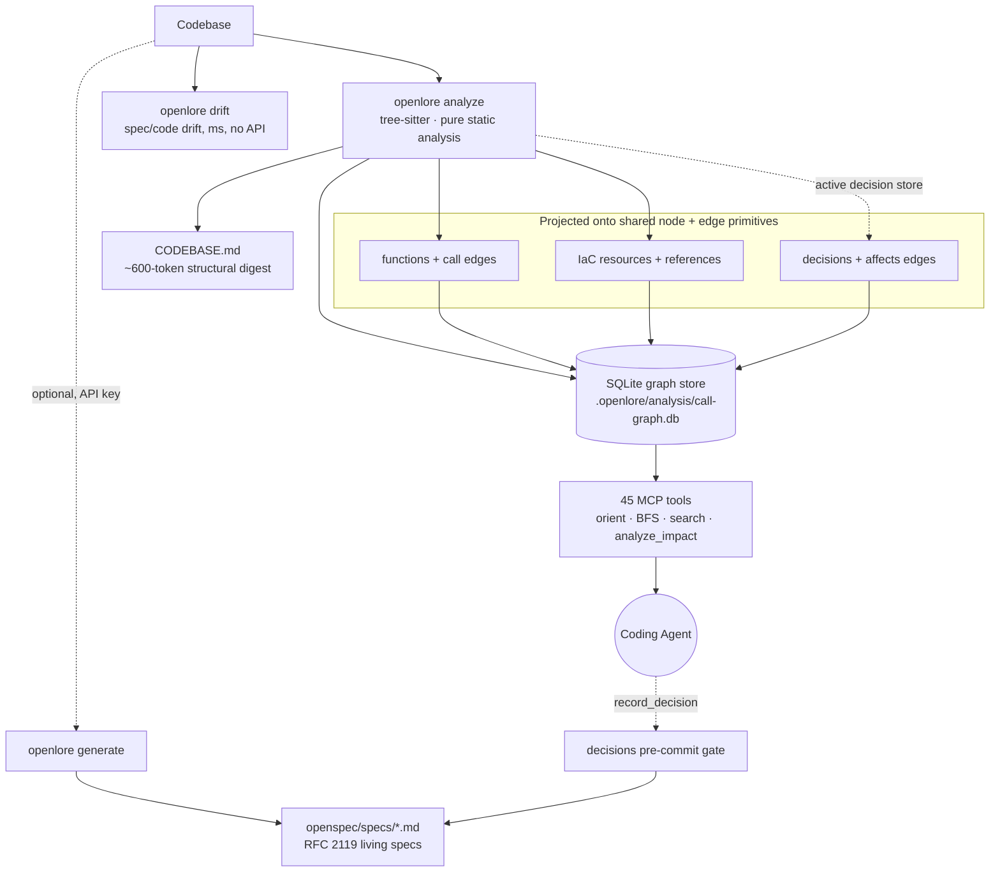
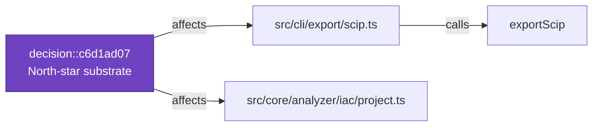

# openlore

> [!NOTE]
> **`spec-gen` has been renamed to `OpenLore`.** The npm package is now [`openlore`](https://www.npmjs.com/package/openlore) and the CLI command is `openlore`. Existing projects: rename your `.spec-gen/` directory to `.openlore/` and reinstall (`npm i -g openlore`). See [docs/RENAME-TO-OPENLORE.md](docs/RENAME-TO-OPENLORE.md) for the full migration checklist.

**Persistent architectural memory and structural cognition for AI coding agents.**

openlore turns any evolving codebase into a navigable knowledge graph backed by [OpenSpec](https://github.com/Fission-AI/OpenSpec) living specifications. It maintains persistent architectural context across agent sessions: graph structure, specs, decisions, drift state, and semantic retrieval — so agents start each task already oriented instead of re-discovering the system from file reads.

---

## Why It Exists

AI agents are powerful but amnesiac. On every new task:

- They re-read the same source files to understand structure
- They forget architectural decisions made two sessions ago
- They have no link between specs and code — drift is invisible
- File-by-file navigation often burns an estimated **15,000–50,000 tokens** per orientation pass, before a single line of useful code is written (measured benefit is task-dependent — it shows up on deep questions in larger codebases, not on small/familiar repos; see the † note below)
- In long sessions, they drift from authoritative retrieval toward internally cached reasoning — producing subtly wrong architectural assumptions that compound silently until a refactor breaks

openlore closes this loop. Run a full analysis once, then keep the graph incrementally updated as the codebase evolves. Even greenfield projects become cognitively "brownfield" after only a few agent sessions — architectural context fragments, decisions disappear, and agents repeatedly reconstruct the same understanding from scratch.

openlore persists that context continuously: structure, specs, decisions, drift state, and graph relationships remain queryable across sessions.

---

## How It Works

Three layers, each usable independently:

| Layer | What it does | API key? |
|-------|-------------|----------|
| **1. Static Analysis** | Call graph, clusters, McCabe CC, external deps → `CODEBASE.md` digest | No |
| **2. Spec Layer** | LLM-generated living specs, ADRs, drift detection, decision gates | For generation |
| **3. Agent Runtime** | 45 MCP tools — `orient()`, semantic search, graph expansion | No |

You can use layer 1 alone to give agents structural context. Add layer 2 for semantic intent and architectural governance through OpenSpec-compatible living specifications. Layer 3 keeps that context continuously accessible through graph-native MCP tools once `openlore mcp` is running.

---

## openlore vs. Alternatives

| | Cursor / Claude Code | Sourcegraph | openlore |
|---|---|---|---|
| Graph-aware MCP context | ❌ file-based reads | Partial | ✓ call graph + clusters |
| Spec drift detection | ❌ | ❌ | ✓ milliseconds, no API |
| Architectural decision gates | ❌ | ❌ | ✓ pre-commit hook |
| Offline structural analysis | ❌ | ❌ | ✓ |
| Token-efficient orient() | ❌ | ❌ | ✓ ~1–3k vs 15–50k tokens † |
| Living spec generation | ❌ | ❌ | ✓ |
| Persistent cross-session architectural memory | ❌ | Partial | ✓ |

† **Measured, and it depends on the task.** The exact token figures above remain
an estimate, but the Spec 14 agent benchmark (`npm run bench:agent`, WITH vs
WITHOUT openlore, `claude -p`, N=4 medians) now gives a measured two-tier result:
- **Small, familiar repos + shallow "who-calls-X" queries:** openlore *adds*
  ~43% cost — the model already knows the code, so there's no orientation to save.
- **Larger codebases + deep "how does X flow through Y" questions (its target):**
  with the lean `--preset navigation` tool surface, openlore is a **net win —
  −7% cost and −26% tool-calls at N=4, scaling with repo size (up to −21% on
  ~640–790-file repos)**, at 100% answer correctness in both arms.

So the headline savings hold where openlore is designed to help, not on toy
queries. Full results, methodology, and honest caveats:
[docs/AGENT-BENCHMARKS.md](docs/AGENT-BENCHMARKS.md). The plumbing latency (orient
~430µs p50) is separate and real — see [scripts/BENCHMARKS.md](scripts/BENCHMARKS.md).
| Long-session confidence decay (Epistemic Lease) | ❌ | ❌ | ✓ |

Traditional coding agents reconstruct architecture from repeated file reads every session. openlore persists it as a queryable graph.

---

## 5-Minute Quickstart

> **One command, no API key needed:**

```bash
npm install -g openlore
cd /path/to/your-project

openlore install          # detect your agent, wire it up, AND build the index
```

That single command:

1. **Auto-detects** which agent surfaces are present (Claude Code, Cursor, Cline, Continue, AGENTS.md) and wires each one to call `orient()` — no manual `CLAUDE.md` editing.
2. **Registers the MCP server** so it starts automatically when your agent launches (you don't run `openlore mcp` yourself).
3. **Builds the index** (`init` + `analyze` → a keyword/BM25 graph, no network needed) so `orient()` returns real results in your very first session — no separate `analyze` step.

```bash
openlore install --no-analyze   # wire surfaces only; build the index later
openlore install --dry-run      # preview every change without writing
```

See [docs/install.md](docs/install.md). The MCP server keeps the index fresh as you edit (file watcher on by default — large build dirs like `target/`, `node_modules/`, `dist/` are pruned automatically; disable entirely with `openlore mcp --no-watch-auto`).

Then ask your agent: **`orient("add a new payment method")`**

That single call returns the relevant functions, their call neighbours, matching spec sections, and insertion-point candidates — preserving architectural continuity across sessions instead of forcing the agent to repeatedly reconstruct context from raw file reads. The Spec 14 benchmark ([docs/AGENT-BENCHMARKS.md](docs/AGENT-BENCHMARKS.md)) measures this directly: on deep "how does X flow through Y" questions in larger codebases, openlore (with `--preset navigation`) cuts cost ~7% and tool-calls ~26% at N=4 (more on bigger repos); on small/familiar repos with shallow queries it adds overhead instead. Net: it pays off in its target arena, not on toy queries.

**Full pipeline** (specs + decisions — optional and additive):

```bash
openlore generate         # generate living specs (requires API key)
openlore drift            # detect spec/code drift
openlore decisions        # manage architectural decisions
```

<details>
<summary>Install from source</summary>

```bash
git clone https://github.com/clay-good/openlore
cd openlore
npm install && npm run build && npm link
```

</details>

<details>
<summary>Nix / NixOS</summary>

```bash
nix run github:clay-good/openlore -- analyze
nix shell github:clay-good/openlore
```

System flake:
```nix
environment.systemPackages = [ openlore.packages.x86_64-linux.default ];
```

</details>

---

## See It In Action

<details>
<summary>Example: orient("add a payment method")</summary>

```json
{
  "functions": [
    {
      "name": "processPayment",
      "file": "src/payments/processor.ts",
      "risk": "medium",
      "fanIn": 4,
      "callers": ["handleCheckout", "retryFailedCharge"],
      "callType": "direct"
    },
    {
      "name": "validateCard",
      "file": "src/payments/validator.ts",
      "risk": "low",
      "fanIn": 1,
      "testedBy": [{ "name": "validateCard.test.ts", "confidence": "called" }]
    }
  ],
  "specDomains": ["payments — §CardValidation, §PaymentFlow"],
  "insertionPoints": [
    "src/payments/processor.ts:87 — after existing charge logic"
  ],
  "callPath": "POST /charge → handleCheckout → processPayment → validateCard → stripeClient.charge"
}
```

One graph query replaces most exploratory file reads. The agent knows exactly where to look and what risks to consider.

</details>

---

## Agent Cheat Sheet

The full surface is 45 tools, but day-to-day work needs a handful. Reach for the right one by situation:

| Situation | Tool |
|-----------|------|
| Starting any task | `orient(task)` — functions, callers, specs, insertion points in one call |
| "Which file/function handles X?" | `search_code` |
| Call topology across many files | `get_subgraph` / `analyze_impact` |
| "What's the blast radius if I change this?" | `analyze_impact` — risk score + up/downstream chain + **governing decisions** |
| "What decisions constrain this code?" | `analyze_impact` / `get_subgraph` → `governingDecisions` (Spec 16) |
| Planning where to add a feature | `suggest_insertion_points` |
| "How does request X reach function Y?" | `trace_execution_path` |
| Recording an architectural choice | `record_decision` **before** writing the code |
| Reading / checking a spec | `get_spec` · `search_specs` · `check_spec_drift` |
| Ranking what changed by risk | `detect_changes` |

Everything else (read a file, grep, list files) uses your native tools. Full reference: [docs/mcp-tools.md](docs/mcp-tools.md).

---

## Use OpenLore as a Claude Code Skill

OpenLore ships a canonical [Claude Code Skill](https://docs.claude.com/en/docs/claude-code/skills) at [`skills/openlore-orient/`](skills/openlore-orient/). Install it once and Claude Code will automatically call `orient()` at the start of every task — no `CLAUDE.md` editing required.

```sh
# From the OpenLore repo root:
npm run skill:install-local           # → ~/.claude/skills/openlore-orient/

# Or copy into a single project's .claude/skills/:
cp -R skills/openlore-orient /path/to/your-project/.claude/skills/
```

The skill bundle ships a `SKILL.md` manifest, POSIX + PowerShell wrappers, a worked example, and a redacted real `orient()` JSON output so the model knows the response shape. See [`skills/openlore-orient/README.md`](skills/openlore-orient/README.md) for details.

---

## Core Features

**Analyze** (no API key)

Continuously maintains a structural representation of your codebase using pure static analysis. Builds a full call graph persisted to SQLite, runs label-propagation community detection to cluster tightly coupled functions, computes McCabe cyclomatic complexity for every function, and extracts DB schemas, HTTP routes, UI components, middleware chains, and environment variables. Outputs `.openlore/analysis/CODEBASE.md` — a ~600-token structural digest that compresses the equivalent of tens of thousands of exploratory tokens into a small, queryable summary.

With `--watch-auto`, the call graph updates incrementally on every file save: changed file and its direct callers are re-parsed and the graph is atomically swapped. Orient and BFS queries remain live between full analyze runs.

**Generate** (API key required)

Sends the analysis to an LLM in 6 structured stages: project survey → entity extraction → service analysis → API extraction → architecture synthesis → ADR enrichment. Produces `openspec/specs/` living specifications in RFC 2119 format with Given/When/Then scenarios.

**Drift** (no API key)

Compares git changes against spec mappings in milliseconds. Detects: Gap (code changed, spec not updated), Uncovered (new file, no spec), Stale (spec references deleted files), ADR gap (code changed in an ADR-referenced domain). Installs as a pre-commit hook.

**Install** (no API key)

`openlore install` auto-wires the popular agent surfaces (Claude Code, Cursor, Cline, Continue, AGENTS.md) so they call `orient()` automatically — no `CLAUDE.md` editing required. Each integration uses a fingerprinted managed block so re-runs are idempotent and hand-edits are detected. `--dry-run` previews diffs; `--uninstall` cleanly removes everything. See [docs/install.md](docs/install.md).

**Preflight** (no API key)

`openlore preflight` is a CI staleness gate: any pull request that edits files in the graph fails the check until the graph is refreshed. Drop-in templates for GitHub Actions, GitLab CI, and generic shell live in [`examples/ci/`](examples/ci/). Weighted scoring surfaces hubs first so a one-line leaf edit doesn't fail the same way a refactor of a top-of-stack module does. See [docs/preflight.md](docs/preflight.md).

**MCP** (no API key)

45 graph-native tools exposed over stdio. Together they act as a persistent architectural runtime for coding agents: orientation, graph traversal, semantic retrieval, drift awareness, decision context, and structural risk analysis.
`orient()` is the main entry point — one call replaces 10+ file reads. `detect_changes` risk-scores changed functions using call graph centrality × change type multiplier. See [docs/mcp-tools.md](docs/mcp-tools.md).

`orient()` runs in **~430µs p50** against a 15k-node codebase (TypeScript compiler, ~79k edges). Full benchmark results: [scripts/BENCHMARKS.md](scripts/BENCHMARKS.md).

**Epistemic Lease** (no API key)

> **Core principle**: EpistemicLease models architectural drift as a behavioral navigation phenomenon rather than a semantic understanding problem. Context decay is driven by where the agent goes (cross-module trajectory), not what it knows.

As a session grows longer, agents naturally shift from authoritative graph retrieval toward internally cached reasoning. This is useful for fluency but dangerous for architectural correctness — cross-module assumptions go stale, dependency hallucinations accumulate, and delegation prompts embed incorrect repository understanding that cannot easily be corrected downstream.

The Epistemic Lease models this decay explicitly. Every MCP tool response carries a freshness signal when the agent's architectural context has degraded or expired. Decay is triggered by any of: time elapsed since `orient()`, git hash divergence from the orient baseline, weighted cognitive load accumulation (heavier tools count more), or cross-module file access breadth.

The signal escalates through three levels to resist [warning blindness](https://en.wikipedia.org/wiki/Alarm_fatigue):

| Level | Trigger | Signal style |
|---|---|---|
| Degraded | load ≥ 30, age ≥ 15min, or cross-module density ≥ 0.15 | Advisory signal appended |
| Stale | load ≥ 60, age ≥ 30min, git hash divergence, or density ≥ 0.30 | Procedural block prepended: what NOT to do |
| Stale [Elevated] | load ≥ 85 or age ≥ 45min | Risk-framing: names downstream consequences |
| Stale [Critical] | load ≥ 110 or age ≥ 60min | Imperative: `STOP. Call orient().` — minimal, hardest to skim |

Cross-module density is computed as a sliding-window trajectory model: `switches_in_last_15_calls / 15`. The fixed denominator prevents false positives during session warmup. Each module switch adds +5 cognitive debt; a high-density window adds +15; a burst (density ≥ 0.60) adds +20. A 5s dampening window prevents back-and-forth from double-counting.

An oscillation coefficient (`repeated_bigram_transitions / total_transitions`) separately distinguishes confusion loops (A→B→A→B scores 1.0) from genuine exploration (A→B→C→D scores 0.0). When already stale, a heavy architectural tool (weight ≥ 8) or density burst (≥ 0.60) triggers immediate escalation to Stale [Critical].

When fresh, injection is zero-overhead. Calling `orient()` resets the tracker. Unlike governance systems, the lease never blocks — it modulates the agent's confidence in its own cached reasoning rather than constraining its actions.

**Decisions** (API key for consolidation)

Agents call `record_decision` before writing code. Consolidation runs immediately in the background. At commit time, a pre-commit hook gates the commit until all verified decisions are reviewed and written back as requirements in `spec.md` files. Decisions are classified by scope (`local / component / cross-domain / system`); only `cross-domain` and `system` decisions produce ADR files, keeping the decision log signal-dense.

Decisions are also **first-class graph nodes**. At analyze time the active decision store is projected — the same parser→projector split that puts Infrastructure-as-Code on the graph — into `decision::<id>` nodes joined to the files they govern by `affects` edges. The relationship is stored, not recomputed: `analyze_impact` and `get_subgraph` return the governing decisions of a symbol and its blast radius as typed neighbors (`nodeType: "decision"`), and `orient` reports which relevant files each decision governs. This turns "what architectural decisions constrain this code, and what does changing it implicate?" into a deterministic graph query — the join no code-navigation competitor offers. The JSON store stays authoritative; the projection is derived and rebuilt on every analyze. See [docs/specs/openlore-spec-16-decisions-as-graph-nodes.md](docs/specs/openlore-spec-16-decisions-as-graph-nodes.md).

**Telemetry** (opt-in, no API key)

Cognitive telemetry for empirical measurement of EpistemicLease behavior. Gated by `OPENLORE_TELEMETRY=1` — disabled by default. Writes append-only JSONL to `.openlore/telemetry/` per domain. Agent identity is captured from the MCP `initialize` handshake, enabling per-agent behavioral comparison.

```
.openlore/telemetry/
  mcp.jsonl              # every tool call: latency, errors, agent name
  orient.jsonl           # orient quality: function/file/insertion_point counts
  cache.jsonl            # readCachedContext hit/miss
  epistemic-lease.jsonl  # state transitions: degraded, stale, depth escalation
```

Analyze with `openlore telemetry`:

```
openlore telemetry [directory]   # summary: latency, cache hit rate, obstinacy index
openlore telemetry --live        # stream events in real time as they occur
```

Key metrics: **obstinacy index** (tool calls after stale before orient — measures whether agents act on warnings), **recovery efficiency** (stale→orient latency), **trajectory dynamics** (avg cross-module density, burst frequency). These turn EpistemicLease from a tuning-by-intuition system into an empirically measurable one.

---

## Architecture

OpenSpec provides semantic intent and workflow structure. openlore maintains the evolving implementation as a continuously queryable architectural graph for agents.



The graph and the OpenSpec spec layer are co-equal: the graph makes orientation fast, the specs make it semantically grounded. Drift detection and decision gates connect both. Crucially, application code, Infrastructure-as-Code, and architectural **decisions** all project onto one shared set of node/edge primitives — so a single traversal answers questions that span all three. See [docs/ARCHITECTURE.md](docs/ARCHITECTURE.md) for the full pipeline diagram.

**Decisions on the graph** (Spec 16) — a decision becomes a node joined to the files it governs by `affects` edges, so impact analysis returns governance as a neighbor:



---

## Design Decisions

OpenLore dogfoods its own decision system. These ADRs were recorded with `record_decision`, gated at commit, and synced into `openspec/specs/` — and (per Spec 16) are now projected onto the graph itself. They are the load-bearing constraints behind the architecture above:

| Decision | Rationale | Where |
|----------|-----------|-------|
| **North star is a deterministic structural context substrate** | Local-first plumbing (like tree-sitter/SCIP/LSP) that agents build on; every feature must make the coding-agent case more useful and stay grounded in static analysis, not LLM guessing | [ADR-0001](openspec/decisions/adr-0001-north-star-is-a-deterministic-structural-context-s.md) |
| **IaC resources project onto the existing graph primitives** | One projector maps infrastructure onto `FunctionNode`/`CallEdge` so every MCP tool works on IaC with zero new tooling | `analyzer` spec · `src/core/analyzer/iac/project.ts` |
| **Decisions project onto the graph the same way** | A parser→projector split turns the decision store into `decision::` nodes + `affects` edges — governance becomes a deterministic graph join | `analyzer` spec · `src/core/decisions/project.ts` (Spec 16) |
| **EdgeStore uses SCHEMA_VERSION rebuild-on-bump, not migrations** | The graph is fully derivable from source, so a schema change drops and rebuilds — no migration code, no drift | `analyzer` spec · `src/core/services/edge-store.ts` |
| **BM25 keyword retrieval is the zero-network floor** | `orient`/`search_code` work with no API key or embedding server; dense embeddings are an optional upgrade, never a requirement | `analyzer` spec · Spec 06 |
| **SCIP is a one-way export, not a round-trip format** | The SQLite graph stays canonical; SCIP exports only the subset it can model, avoiding a lossy bidirectional contract | `cli` spec · `src/cli/export/scip.ts` |
| **MCP exposes a curated `navigation` preset, not all 45 tools** | A lean graph-traversal surface is what wins the Spec 14 agent benchmark; the full set stays available opt-in | `cli` spec · Spec 14 |
| **Decision consolidation is serialized with a cross-process file lock** | Concurrent `record_decision` calls were losing drafts; a lock makes consolidation safe and every commit instant | `cli` spec · Spec 15 |

This table is not aspirational documentation — it is the live decision log the pre-commit gate enforces and Spec 16 makes queryable. See [docs/governance-dogfooding.md](docs/governance-dogfooding.md).

---

## Interop

OpenLore exports [SCIP](https://github.com/sourcegraph/scip) (Source Code Intelligence Protocol). Plug it into Sourcegraph code nav, GitHub stack graphs, Glean importers, or any SCIP-aware tool:

```bash
openlore analyze            # build the graph (if you haven't already)
openlore export scip        # writes ./index.scip
```

The SQLite graph stays canonical; SCIP is a one-way export of the subset SCIP can model (functions → symbols, call edges → occurrences). See [docs/scip-export.md](docs/scip-export.md) for what is and isn't exported and how to consume it.

---

## Federation (cross-repo)

The hardest agent-orientation questions cross repo boundaries: who calls `BillingService.refund`, where is event `X` consumed, how does data flow from service A to service B. OpenLore's answer is "SBOM-of-cognition" — every repo publishes a small, public, deterministic manifest describing what it exposes:

```bash
openlore manifest emit        # writes ./.well-known/openlore.json
openlore manifest validate .well-known/openlore.json
```

The manifest captures the public API surface, HTTP routes, stats, dependencies, and spec state in a [versioned schema](schemas/openlore-manifest-v1.json). A future OpenLore federation index will read these manifests across many repos to answer cross-repo `orient()` questions, staying a thin merger rather than a giant analyzer. See [docs/federation.md](docs/federation.md).

---

## Documentation

| Topic | Doc |
|-------|-----|
| MCP tools reference (45 tools + parameters) | [docs/mcp-tools.md](docs/mcp-tools.md) |
| Agent setup (Claude Code, Cline, OpenCode, Vibe…) | [docs/agent-setup.md](docs/agent-setup.md) |
| `openlore install` — auto-configure agent surfaces | [docs/install.md](docs/install.md) |
| LLM providers + embedding config | [docs/providers.md](docs/providers.md) |
| Drift detection in depth | [docs/drift-detection.md](docs/drift-detection.md) |
| Spec-driven tests + spec digest | [docs/spec-tests.md](docs/spec-tests.md) |
| CI/CD integration | [docs/ci-cd.md](docs/ci-cd.md) |
| Preflight CI staleness gate | [docs/preflight.md](docs/preflight.md) |
| SCIP export (Sourcegraph/Glean interop) | [docs/scip-export.md](docs/scip-export.md) |
| Cross-domain impact (code ↔ infrastructure) | [docs/cross-domain-impact.md](docs/cross-domain-impact.md) |
| Federation manifest (cross-repo) | [docs/federation.md](docs/federation.md) |
| CLI command reference | [docs/cli-reference.md](docs/cli-reference.md) |
| Interactive graph viewer | [docs/viewer.md](docs/viewer.md) |
| Analysis output files | [docs/output.md](docs/output.md) |
| Configuration reference | [docs/configuration.md](docs/configuration.md) |
| Programmatic API | [docs/api.md](docs/api.md) |
| Pipeline architecture | [docs/pipeline.md](docs/pipeline.md) |
| Internal design | [docs/ARCHITECTURE.md](docs/ARCHITECTURE.md) |
| Algorithms | [docs/ALGORITHMS.md](docs/ALGORITHMS.md) |
| Agentic workflows (BMAD, Vibe, GSD, spec-kit) | [docs/agentic-workflows.md](docs/agentic-workflows.md) |
| Troubleshooting | [docs/TROUBLESHOOTING.md](docs/TROUBLESHOOTING.md) |
| Philosophy | [docs/PHILOSOPHY.md](docs/PHILOSOPHY.md) |
| Telemetry & cognitive metrics | [docs/telemetry.md](docs/telemetry.md) |

---

## Known Limitations

- **Incremental call graph updates are depth-1 only**: the MCP file watcher (`--watch-auto`, on by default) re-indexes signatures and edges on save for the changed file and its direct callers. Transitive callers (A→B→C, C changes, A stays stale) are only refreshed by the next `analyze --force`. For hub files with 100+ callerFiles, re-parse may take several seconds. The watcher prunes build/dependency directories (`target/`, `node_modules/`, `dist/`, `.venv/`, `vendor/`, …) so it stays light even on large repos; turn it off entirely with `openlore mcp --no-watch-auto`.
- **Static analysis only**: dynamic dispatch, runtime metaprogramming, and `eval`-based patterns are not captured in the call graph.
- **LLM spec quality varies**: generated specs reflect the model's understanding. Review sections covering complex business logic before treating them as authoritative.
- **Embedding is optional**: plain `openlore analyze` (no `--embed`, no `EMBED_*`) builds a keyword (BM25) search index out of the box, so `orient`, `search_code`, `suggest_insertion_points`, and `search_specs` work immediately. Configure an embedding endpoint (`EMBED_BASE_URL`/`EMBED_MODEL` or an `embedding` block in `.openlore/config.json`) to upgrade to hybrid dense+BM25 search, which is more accurate for semantic queries.
- **Large monorepos**: `openlore analyze` on large codebases may take several minutes. Graph storage itself has no practical limit — the pipeline (AST parsing, symbol extraction) is the bottleneck.
- **`node:sqlite` experimental warning on Node 22**: Node.js 22 prints `ExperimentalWarning: SQLite is an experimental feature` to stderr. The warning is gone on Node 24+. Suppress on Node 22 with `NODE_NO_WARNINGS=1 openlore analyze`.

---

## Requirements

- Node.js 22.5+
- API key for `generate`, `verify`, and `drift --use-llm`:
  ```bash
  export ANTHROPIC_API_KEY=sk-ant-...    # default provider
  export OPENAI_API_KEY=sk-...           # OpenAI
  export GEMINI_API_KEY=...              # Google Gemini
  ```
  Or use a CLI-based provider (`claude-code`, `gemini-cli`, `mistral-vibe`, `cursor-agent`) — no API key, just the CLI on your PATH.
- `analyze`, `drift`, `mcp`, and `init` require no API key

**Languages supported**: TypeScript · JavaScript · Python · Go · Rust · Ruby · Java · C++ · Swift · C# · Kotlin · PHP · C · Scala · Dart · Lua · Elixir · Bash — call graphs ride the same node/edge primitives for every language. See [docs/languages.md](docs/languages.md) for per-language extraction limits and the `.h` C/C++ rule.

**Infrastructure-as-Code**: Terraform/HCL · Kubernetes · Helm · CloudFormation · Ansible · Pulumi · AWS CDK · CDKTF — IaC resources and their references are projected onto the same graph as application code, so `orient`, `search_code`, `get_subgraph`, and `analyze_impact` answer "what is the blast radius of changing this security group / ConfigMap / IAM role?" with zero new tooling. See [docs/iac.md](docs/iac.md).

**Cross-domain impact** (Spec 17): for embedded IaC (Pulumi/CDK/CDKTF), the code that provisions a resource is linked to it by a `references` edge, so `analyze_impact` traverses the code↔infra boundary **end-to-end** — "what infrastructure does this handler reach?" and the reverse, "what code breaks if I change this resource?". Infra neighbors are surfaced as a typed, ecosystem-tagged `crossDomain` block, distinct from the code blast radius. A code-only navigator structurally cannot answer this. Reproducible example: [docs/cross-domain-impact.md](docs/cross-domain-impact.md).

---

## Development

```bash
npm install
npm run build
npm test          # 2900+ unit tests
npm run typecheck
```

---

## Links

- [OpenSpec](https://github.com/Fission-AI/OpenSpec) — spec-driven development framework
- [AGENTS.md](AGENTS.md) — system prompt for direct LLM prompting
- [Examples](examples/) — BMAD, Vibe, GSD, drift-demo, spec-kit integrations
