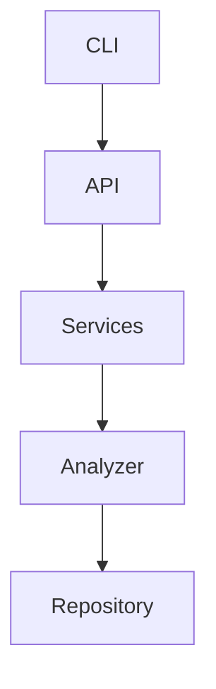

# Architecture Specification

> Generated by openlore v1.0.0 on 2026-04-05 10:50

## Purpose

This document describes the architectural patterns and structure of the system.

## Architecture Style

Layered architecture: CLI interface → API layer → service layer → repository pattern over various
data sources. This pattern is chosen for its clear separation of concerns, ease of maintenance, and
scalability.

## Requirements

### Requirement: LayeredArchitecture

The system SHALL maintain separation between:
- CLI (Command-line interface for user interaction and command processing)
- API (API endpoints and command handlers)
- Services (Business logic and orchestration)
- Analyzer (Code analysis and data extraction)
- Repository (Data persistence and retrieval)

#### Scenario: LayerSeparation
- **GIVEN** a request from the presentation layer
- **WHEN** business logic is needed
- **THEN** the presentation layer delegates to the business layer
- **AND** direct database access from presentation is prohibited

### Requirement: SecurityModel

The system SHALL implement security via: API key-based authentication for LLM providers; no user authentication for CLI tool

#### Scenario: AuthenticatedAccess
- **GIVEN** an unauthenticated request
- **WHEN** accessing protected resources
- **THEN** access is denied

### Requirement: DurableAtomicStorePersistence

The persisted memory and decision stores (`.openlore/memory/notes.json`,
`.openlore/decisions/pending.json`) SHALL be written atomically: a write goes to a
uniquely-named temporary file, is `fsync`'d, and is moved into place with an atomic rename,
after which the containing directory is `fsync`'d (best-effort) so the rename itself is
durable. A crash or interruption mid-write leaves the previously committed store intact and
never a partially written (torn) file. Each store SHALL carry a monotonic `sequence` field
(defaults to `0` for legacy stores) that orders writes and lets external readers detect
change. The read-modify-write SHALL be performed entirely inside a single per-store advisory
lock so that the lock — not an optimistic sequence guard — is the serialization point:
`mutate` always runs against the freshest on-disk store and a competing write cannot
interleave. The advisory lock SHALL carry an ownership token and be released only by the
writer that still owns it (so a hold stolen as stale is never freed out from under its new
owner); a crashed holder's lock SHALL become stealable well before a waiter gives up, and a
wait that times out SHALL fail loud rather than write unlocked. ALL writers of a given store
(record, approve/reject, consolidation, sync, and HTTP-API equivalents) SHALL go through this
single compare-and-swap path; a raw lock-free overwrite is prohibited because it would defeat
the serialization. Implemented in `src/core/decisions/atomic-store.ts`; guarded by
`atomic-store.test.ts`.

#### Scenario: A crash mid-write preserves the prior store
- **GIVEN** a store write interrupted between writing the temporary file and the rename
- **WHEN** the store is next loaded
- **THEN** the previously committed store is returned intact, with no torn or partial content

#### Scenario: Save uses compare-and-swap on sequence
- **GIVEN** a store loaded at sequence S
- **WHEN** a save is attempted but the on-disk sequence is no longer S
- **THEN** the save re-reads the current store, re-applies the pending change, and writes at
  the new sequence instead of overwriting

### Requirement: CorruptStoreQuarantineNotSilentEmpty

When a persisted store fails validation on load, the system SHALL move the unreadable file
aside to a quarantine path (`*.corrupt-<n>`) and emit a recoverable signal. The system SHALL
NOT silently substitute an empty store for a corrupt one, because silently losing persisted
memory presents absence as current fact and violates the authoritative-recall invariant. The
quarantine suffix SHALL be derived from on-disk state (the next free index), not wall-clock
time, to keep recovery reproducible. The claim on a quarantine path SHALL be atomic (it fails
if the path already exists), so two concurrent loaders can never overwrite each other's
quarantine file and lose preserved bytes.

#### Scenario: A malformed store is quarantined, not silently emptied
- **GIVEN** a store file that fails schema or JSON validation
- **WHEN** the store is loaded
- **THEN** the file is moved to `*.corrupt-<n>` and a recoverable signal is emitted, rather
  than an empty store being returned silently

## System Diagram

## Layer Structure

### CLI

**Purpose**: Command-line interface for user interaction and command processing
**Location**: `src/cli/commands/mcp.ts, src/cli/commands/view.ts, src/cli/commands/openlore.ts`

### API

**Purpose**: API endpoints and command handlers
**Location**: `src/api/run.ts, src/api/generate.ts, src/api/init.ts, src/api/drift.ts`

### Services

**Purpose**: Business logic and orchestration
**Location**: `src/core/services/config-manager.ts, src/core/services/llm-service.ts, src/core/services/chat-tools.ts, src/core/services/mcp-handlers/utils.ts`

### Analyzer

**Purpose**: Code analysis and data extraction
**Location**: `src/core/analyzer/signature-extractor.ts, src/core/analyzer/call-graph.ts, src/core/analyzer/vector-index.ts`

### Repository

**Purpose**: Data persistence and retrieval
**Location**: `src/utils/command-helpers.ts, src/core/services/mcp-handlers/utils.ts`

## Data Flow

CLI command → API endpoint → service → analyzer → repository; results are returned to the user via
CLI output or API responses

## External Integrations

| System | Purpose |
|--------|---------|
| Git | External integration |
| OpenAI-compatible APIs (Gemini, Anthropic, OpenAI, etc.) | External integration |
| LanceDB for vector indexing | External integration |
| tree-sitter for code parsing | External integration |
